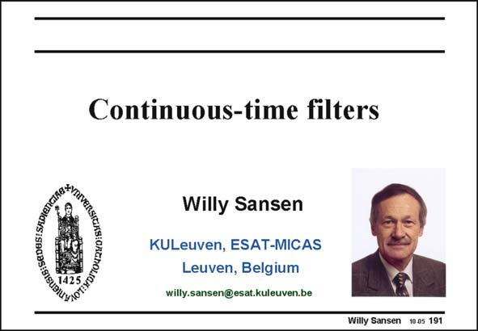

# SANSEN-191 · Slide 191

章节：19 连续时间滤波器  
PDF 页：556；书本页：567；幻灯片编号：191  
状态：unreviewed



## 对应教材讲解

### PDF 556 · 书本 567

An important class of filters are continuous-time filters. They are filters which don’t use switches. They are used mainly at high frequencies, but also for a variety of other applications. Their biggest problem is distortion. This is why this Chapter follows the Chapter on distortion. The several filter types are discussed first. Considerable attention is paid to transconductors with low distortion. Before sampling, anti-aliasing filters are required to limit the signal bandwidth. A prefilter is required, which has to be a continuous-time filter. High-frequency filters are also usually continuous-time filters. In sampled-data filters, the clock frequencies must be higher than the highest signal frequencies. Exceedingly high clock frequencies would therefore be needed, consuming too much power. In communications systems (CDMA, UWB, etc.), channel bandwidths reach values of up to 5, 7 and even 10 MHz. Separation of these channels require thus many high-frequency filters. Finally, high-frequency filters turn into low-frequency filters when the power consumption is reduced drastically. In portable applications, continuous-time filters also play an important role, even at low frequencies (e.g. sensor interfaces, ...).

## 公式／性能结论候选摘录

以下为规则截取的原文，尚未逐项判读。

- PDF 556: Before sampling, anti-aliasing filters are required to limit the signal bandwidth.
- PDF 556: Exceedingly high clock frequencies would therefore be needed, consuming too much power.
- PDF 556: Separation of these channels require thus many high-frequency filters.

## 曲线结论候选摘录

以下为规则截取的原文，尚未逐项判读。

（未由规则找到；不代表原页没有此类内容。）

## 原文条件与近似候选摘录

以下为规则截取的原文，尚未逐项判读。

（未由规则找到；不代表原页没有此类内容。）

## 幻灯片 OCR（未校正）

```text
GIG: SEDESI SRDIanG
Continuous-time filters
Willy Sansen
KULeuven, ESAT-MICAS
Leuven, Belgium
willy.sansen@esat.kuleuven.be
Willy Sansen 10.05 191
```

数学上下标、分数及正负号以原图为准。电路图已保留；未核对的连接不输出成可仿真 netlist。
