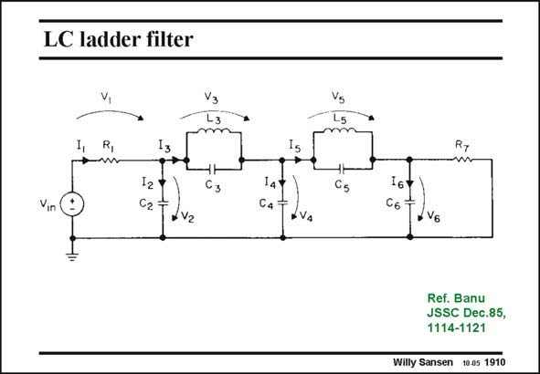

# SANSEN-1910 · LC ladder filter

章节：19 连续时间滤波器  
PDF 页：560；书本页：571；幻灯片编号：1910  
状态：unreviewed



## 对应教材讲解

### PDF 560 · 书本 571

For example, take this LC ladder filter. It is known to be fairly insensitive to errors on the values of L and C. Except for the source resistor R and the load resistor 1 R , five branches can be 7 distinguished. Each node is connected to ground through a capacitor. It is therefore a low pass filter. Each branch will be represented by an opamp with feedback elements, as shown next. The circuit must be converted into a differential structure first!

## 公式／性能结论候选摘录

以下为规则截取的原文，尚未逐项判读。

- PDF 560: It is therefore a low pass filter.

## 曲线结论候选摘录

以下为规则截取的原文，尚未逐项判读。

（未由规则找到；不代表原页没有此类内容。）

## 原文条件与近似候选摘录

以下为规则截取的原文，尚未逐项判读。

（未由规则找到；不代表原页没有此类内容。）

## 幻灯片 OCR（未校正）

```text
LC ladder filter
R,
-w
I3
Cз
C2T
C4
R7
Cs
Ref. Banu
JSSC Dec.85,
1114-1121
Willy Sansen 10.05 1910
```

数学上下标、分数及正负号以原图为准。电路图已保留；未核对的连接不输出成可仿真 netlist。
