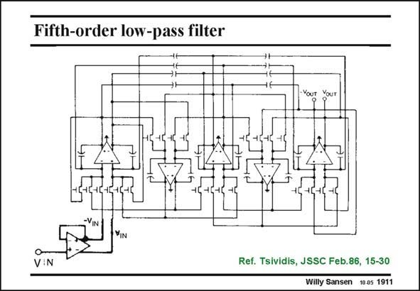

# SANSEN-1911 · Fifth-order low-pass filter

章节：19 连续时间滤波器  
PDF 页：561；书本页：572；幻灯片编号：1911  
状态：unreviewed



## 对应教材讲解

### PDF 561 · 书本 572

A similar fifth-order ladder filter is shown in this slide. It is a fully differential filter indeed to cancel out even-order distortion. All capacitors are fixed but the MOST resistors can be tuned by means of the control voltage at all the Gates. A sixth opamp is used to convert the single-ended input into a differential one.

## 公式／性能结论候选摘录

以下为规则截取的原文，尚未逐项判读。

（未由规则找到；不代表原页没有此类内容。）

## 曲线结论候选摘录

以下为规则截取的原文，尚未逐项判读。

（未由规则找到；不代表原页没有此类内容。）

## 原文条件与近似候选摘录

以下为规则截取的原文，尚未逐项判读。

（未由规则找到；不代表原页没有此类内容。）

## 幻灯片 OCR（未校正）

```text
Fifth-order low-pass filter
YIN
V:N
Ref. Tsividis, JSSC Feb.86, 15-30
Willy Sansen 10.05 1911
```

数学上下标、分数及正负号以原图为准。电路图已保留；未核对的连接不输出成可仿真 netlist。
