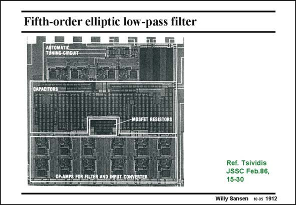

# SANSEN-1912 · Fifth-order elliptic low-pass filter

章节：19 连续时间滤波器  
PDF 页：561；书本页：572；幻灯片编号：1912  
状态：unreviewed



## 对应教材讲解

### PDF 561 · 书本 572

These six opamps are easily seen at the bottom of the layout. The bank of capacitors takes the larger area, because of better matching. The area required for the MOST resistors is quite small. The tuning circuitry takes a rather large area. It is discussed next.

## 公式／性能结论候选摘录

以下为规则截取的原文，尚未逐项判读。

（未由规则找到；不代表原页没有此类内容。）

## 曲线结论候选摘录

以下为规则截取的原文，尚未逐项判读。

（未由规则找到；不代表原页没有此类内容。）

## 原文条件与近似候选摘录

以下为规则截取的原文，尚未逐项判读。

（未由规则找到；不代表原页没有此类内容。）

## 幻灯片 OCR（未校正）

```text
Fifth-order elliptic low-pass filter
OP-AMPS FOR FILTER AND INPUT COI
Ref. Tsividis
JSSC Feb.86,
15-30
Willy Sansen
10.05 1912
```

数学上下标、分数及正负号以原图为准。电路图已保留；未核对的连接不输出成可仿真 netlist。
