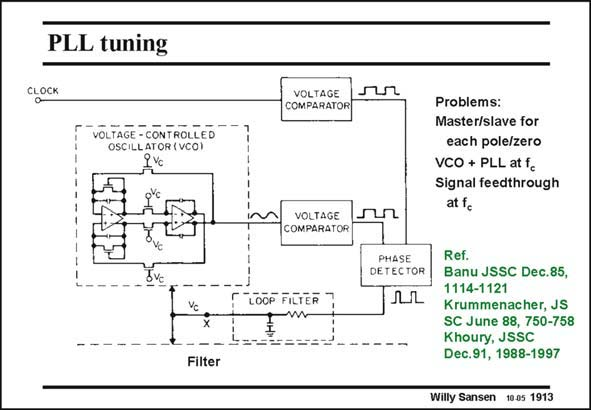

# SANSEN-1913 · PLL tuning

章节：19 连续时间滤波器  
PDF 页：562；书本页：573；幻灯片编号：1913  
状态：unreviewed



## 对应教材讲解

### PDF 561 · 书本 572

The tuning circuit is a Phase-locked loop. It generates the filter control voltage V , as a result c of a feedback loop. This loop consists of a Voltage-controlled oscillator (VCO), which generates a frequency (phase), which is compared to the reference frequency (phase) of the clock in the phase detector. The output of this phase detector, which is actually a multiplier, contains the sum and the difference of the input frequencies. The sum frequency is a high frequency and is filtered out by the low-pass loop filter. The difference frequency is a slowly varying signal, which is fed back to the VCO. This is control frequency V indeed. c The VCO uses the same opamps as in the filter. Also, the capacitors and MOST resistors are

### PDF 562 · 书本 573

of the same order of magnitude as the ones in the filter, for good matching. A control Voltage V is obtained c which generates a VCO frequency f , which is locked to c the external clock frequency. As a result, the filter frequencies are also locked to the external clock frequency. This clock is most often a crystal oscillator with high accuracy (see Chapter 22). The filter frequencies can be expected to have similar high accuracies. The main disadvantage of such a tuning circuit is that a lot of additional circuitry is required and that the VCO frequency f is in the same region as the filter frequency. Leakage from the VCO to the signal path is thus c hard to avoid. Other tuning schemes will be discussed later.

## 公式／性能结论候选摘录

以下为规则截取的原文，尚未逐项判读。

- PDF 561: It generates the filter control voltage V , as a result c of a feedback loop.
- PDF 562: As a result, the filter frequencies are also locked to the external clock frequency.
- PDF 562: Leakage from the VCO to the signal path is thus c hard to avoid.

## 曲线结论候选摘录

以下为规则截取的原文，尚未逐项判读。

- PDF 561: The tuning circuit is a Phase-locked loop.
- PDF 561: This loop consists of a Voltage-controlled oscillator (VCO), which generates a frequency (phase), which is compared to the reference frequency (phase) of the clock in the phase detector.
- PDF 561: The output of this phase detector, which is actually a multiplier, contains the sum and the difference of the input frequencies.

## 原文条件与近似候选摘录

以下为规则截取的原文，尚未逐项判读。

（未由规则找到；不代表原页没有此类内容。）

## 幻灯片 OCR（未校正）

```text
PLL tuning
CLOCK
VOLTAGE - CONTROLLED
OSCILLATOR (VCO)
Ivc
Filter
VOLTAGE
COMPARATOR
VOLTAGE
COMPARATOR
LOÕP FILTER
Problems:
Master/slave for
each pole/zero
VCO + PLL at fc
Signal feedthrough
at fo
PHASE
DETECTOR
Ref.
Banu JSSC Dec.85,
1114-1121
Krummenacher, JS
SC June 88, 750-758
Khoury, JSSC
Dec.91, 1988-1997
Willy Sansen 10.05 1913
```

数学上下标、分数及正负号以原图为准。电路图已保留；未核对的连接不输出成可仿真 netlist。
