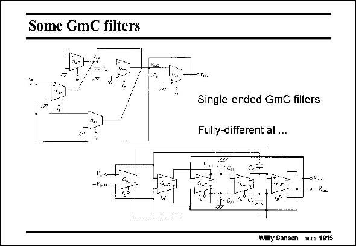

# SANSEN-1915 · Some GmC filters

章节：19 连续时间滤波器  
PDF 页：563；书本页：574；幻灯片编号：1915  
状态：unreviewed



## 对应教材讲解

### PDF 563 · 书本 574

GmC filters consist of Gm blocks, which are not much more than linearized differential pairs and capacitors. A second-order filter is shown on the left. It is single-ended. To cancel out the evenorder harmonics, a differential version is preferred. It is shown on the right. They take more power as the output circuitry is doubled. Moreover, common-mode feedback is required to set the common-mode or average output (and input) voltage levels. Even more power is therefore consumed. They are now studied in more detail.

## 公式／性能结论候选摘录

以下为规则截取的原文，尚未逐项判读。

- PDF 563: Even more power is therefore consumed.

## 曲线结论候选摘录

以下为规则截取的原文，尚未逐项判读。

（未由规则找到；不代表原页没有此类内容。）

## 原文条件与近似候选摘录

以下为规则截取的原文，尚未逐项判读。

（未由规则找到；不代表原页没有此类内容。）

## 幻灯片 OCR（未校正）

```text
Some GmC filters
n Kis:
Single-ended GmC filters
Fully-differential ...
0-k0n2
Willy Sansen 1s 1915
```

数学上下标、分数及正负号以原图为准。电路图已保留；未核对的连接不输出成可仿真 netlist。
