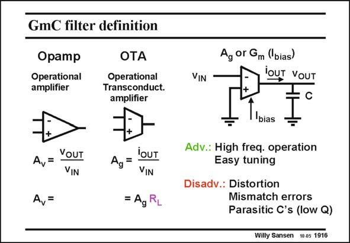

# SANSEN-1916 · GmC filter definition

章节：19 连续时间滤波器  
PDF 页：563；书本页：574；幻灯片编号：1916  
状态：unreviewed



## 对应教材讲解

### PDF 563 · 书本 574

Such a Gm block differs from an opamp in the sense that it does not include an output stage with low output resistance. A Gm block generates an output current proportional to the input voltage. Comparison with an opamp is only possible provided an output resistor R is added. L A considerable advantage of such a Gm block is that its transconductance Gm directly depends on the biasing current I . If the input bias MOSTs work in strong inversion, the Gm is proportional to the square root of the current. If MOSTs are used in weak inversion however, or when bipolar transistors are used, then the Gm is directly proportional to the current. The tuning is relatively easy. Because of their simplicity, these circuits are able to operate up to high frequencies. The drawbacks are still the same, distortion and mismatch. Moreover, each node has a parasitic capacitance to ground, limiting the high frequency performance.

## 公式／性能结论候选摘录

以下为规则截取的原文，尚未逐项判读。

- PDF 563: A Gm block generates an output current proportional to the input voltage.
- PDF 563: L A considerable advantage of such a Gm block is that its transconductance Gm directly depends on the biasing current I .
- PDF 563: If the input bias MOSTs work in strong inversion, the Gm is proportional to the square root of the current.
- PDF 563: If MOSTs are used in weak inversion however, or when bipolar transistors are used, then the Gm is directly proportional to the current.
- PDF 563: Moreover, each node has a parasitic capacitance to ground, limiting the high frequency performance.

## 曲线结论候选摘录

以下为规则截取的原文，尚未逐项判读。

（未由规则找到；不代表原页没有此类内容。）

## 原文条件与近似候选摘录

以下为规则截取的原文，尚未逐项判读。

- PDF 563: Comparison with an opamp is only possible provided an output resistor R is added.

## 幻灯片 OCR（未校正）

```text
GmC filter definition
Оpamp
Operational
amplifier
OTA
Operational
Transconduct.
amplifier
A,=
YOUT
VIN
A,=
loUT
Ag =
VIN
= Ag RL
VIN
Ag or Gm (bias)
lOUT VOUT
bias
Adv.: High freq. operation
Easy tuning
Disadv.: Distortion
Mismatch errors
Parasitic C's (low Q)
Willy Sansen 10.05 1916
```

数学上下标、分数及正负号以原图为准。电路图已保留；未核对的连接不输出成可仿真 netlist。
