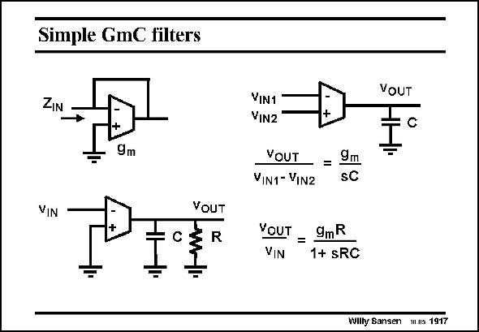

# SANSEN-1917 · Simple GmC filters

章节：19 连续时间滤波器  
PDF 页：564；书本页：575；幻灯片编号：1917  
状态：unreviewed



## 对应教材讲解

### PDF 564 · 书本 575

Some simple filter structures with Gm blocks are shown in this slide. Feedback from the output to the minus input turns the Gm block into a resistance with value 1/g . m Using a Gm block open loop provides a pole determined by the output load capacitance. This is actually an integrator. If a parallel RC circuit is used as a load, then a voltage amplifier is obtained with gain g R and a pole m with time constant RC.

## 公式／性能结论候选摘录

以下为规则截取的原文，尚未逐项判读。

- PDF 564: If a parallel RC circuit is used as a load, then a voltage amplifier is obtained with gain g R and a pole m with time constant RC.

## 曲线结论候选摘录

以下为规则截取的原文，尚未逐项判读。

（未由规则找到；不代表原页没有此类内容。）

## 原文条件与近似候选摘录

以下为规则截取的原文，尚未逐项判读。

（未由规则找到；不代表原页没有此类内容。）

## 幻灯片 OCR（未校正）

```text
Simple GmC filters
ZIN
- 9m
VIN
VOUT
VOUT
VIN1
VIN2
YOUT = 9m
VIN1- VIN2
SC
YOUT
=
9mR
VIN
1+ sRC
Wilty Sansen 1us 1917
```

数学上下标、分数及正负号以原图为准。电路图已保留；未核对的连接不输出成可仿真 netlist。
