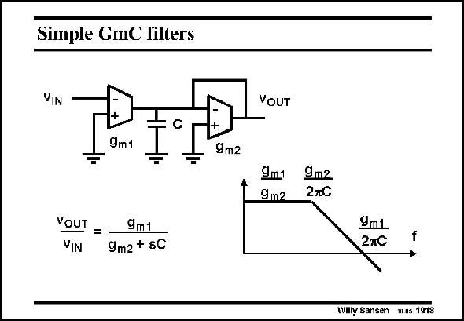

# SANSEN-1918 · Simple GmC filters

章节：19 连续时间滤波器  
PDF 页：564；书本页：575；幻灯片编号：1918  
状态：unreviewed



## 对应教材讲解

### PDF 564 · 书本 575

As a load a Gm block or transconductor can be used as well. The voltage gain is now the ratio of the two transconductances. The pole is determined by g and the m2 capacitance C at the intermediate node. The GBW is obviously determined by g and the m1 capacitance C at that intermediate node. This same structure can better be realized in a differential configuration, as shown next.

## 公式／性能结论候选摘录

以下为规则截取的原文，尚未逐项判读。

- PDF 564: The voltage gain is now the ratio of the two transconductances.

## 曲线结论候选摘录

以下为规则截取的原文，尚未逐项判读。

（未由规则找到；不代表原页没有此类内容。）

## 原文条件与近似候选摘录

以下为规则截取的原文，尚未逐项判读。

（未由规则找到；不代表原页没有此类内容。）

## 幻灯片 OCR（未校正）

```text
Simple GmC filters
VIN
+
9m1
9m2
voUT =
9m1
VIN
9m2 + SC
YOUT
9m1 9m2
9m2
2TC
9m1
2тC
Willy Sansen us 1918
```

数学上下标、分数及正负号以原图为准。电路图已保留；未核对的连接不输出成可仿真 netlist。
