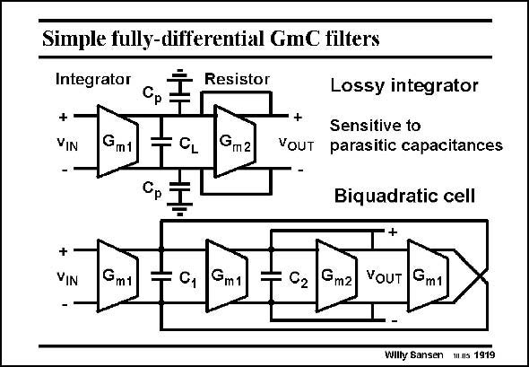

# SANSEN-1919 · Simple fully-differential GmC filters

章节：19 连续时间滤波器  
PDF 页：565；书本页：576；幻灯片编号：1919  
状态：unreviewed



## 对应教材讲解

### PDF 564 · 书本 575

A differential configuration of a voltage amplifier is shown in this slide. The gain is the ratio of the two transconductances. The pole is determined by g and the capacitance C at the m2 L intermediate node. In order to make sure this pole frequency is accurate, the parasitic capacitances C must be p negligible with respect to the load capacitance C . This limits the minimum value of C and the L L upper value of the pole frequency.

### PDF 565 · 书本 576

A more complicated filter structure is shown below. It is a second-order filter which is biquadratic. This means that both the numerator and the denominator of the transfer function are of second-order. For this purpose, two capacitances are used and four transconductors.

## 公式／性能结论候选摘录

以下为规则截取的原文，尚未逐项判读。

- PDF 564: The gain is the ratio of the two transconductances.
- PDF 564: This limits the minimum value of C and the L L upper value of the pole frequency.

## 曲线结论候选摘录

以下为规则截取的原文，尚未逐项判读。

（未由规则找到；不代表原页没有此类内容。）

## 原文条件与近似候选摘录

以下为规则截取的原文，尚未逐项判读。

（未由规则找到；不代表原页没有此类内容。）

## 幻灯片 OCR（未校正）

```text
Simple fully-differential GmC filters
Integrator
Cр
+
YIN
Gm1
Resistor
Gm2
+
VOUT
Lossy integrator
Sensitive to
parasitic capacitances
Biquadratic cell
+
VIN
Gmt
Gm1
02
Gm2
VOUT
Gm1
Willy Sansen Is 1919
```

数学上下标、分数及正负号以原图为准。电路图已保留；未核对的连接不输出成可仿真 netlist。
