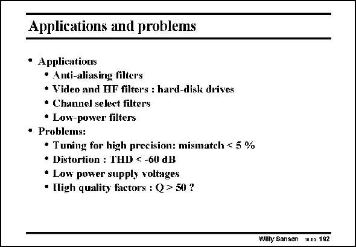

# SANSEN-192 · Applications and problems

章节：19 连续时间滤波器  
PDF 页：556；书本页：567；幻灯片编号：192  
状态：unreviewed



## 对应教材讲解

### PDF 556 · 书本 567

However, continuous-time filters have many problems. The characteristic frequencies are not very accurate. It is difficult to realize higherorder filters which require accurate matching of the characteristic frequencies. Tuning circuits will thus have to be added, which increase the power consumption. Linearity is also a problem. Filters are normally specified for fairly large input voltages. To reduce the distortion to below −60 dB, both feedback and cancellation techniques will be required.

### PDF 557 · 书本 568

This is especially true at low supply voltages. The signal swings cannot be allowed to be smaller. Distortion reduction is now even more important! Putting al these problems together, especially mismatch and distortion, means that it is difficult to reach filters with high quality factors.

## 公式／性能结论候选摘录

以下为规则截取的原文，尚未逐项判读。

- PDF 556: Tuning circuits will thus have to be added, which increase the power consumption.

## 曲线结论候选摘录

以下为规则截取的原文，尚未逐项判读。

- PDF 556: The characteristic frequencies are not very accurate.
- PDF 556: It is difficult to realize higherorder filters which require accurate matching of the characteristic frequencies.

## 原文条件与近似候选摘录

以下为规则截取的原文，尚未逐项判读。

（未由规则找到；不代表原页没有此类内容。）

## 幻灯片 OCR（未校正）

```text
Applications and problems
• Applications
• Anti-aliasing filters
• Video and HF filters : hard-disk drives
• Channel select filters
• Low-power filters
• Problems:
• Tuning for high precision: mismatch < 5 %
• Distortion : THD < -60 dB
• Low power supply voltages
• Migh quality factors : Q > 50 ?
Willy Sansen mus 192
```

数学上下标、分数及正负号以原图为准。电路图已保留；未核对的连接不输出成可仿真 netlist。
