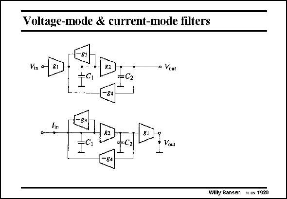

# SANSEN-1920 · Voltage-mode & current-mode filters

章节：19 连续时间滤波器  
PDF 页：565；书本页：576；幻灯片编号：1920  
状态：unreviewed



## 对应教材讲解

### PDF 565 · 书本 576

Such filters are usually driven by an input voltage. This is not necessary, however. As an example, let us take the second-order GmC filter shown in this slide. Moving the input transconductor g 1 towards the output, gives the same transfer function but for the current ratio I /I , rather than for the out in voltage ratio V /V . out in Voltage GmC filters can easily be converted into current GmC filters. However, we will see later that in general, current-mode filters have a lower SNR (by about 20 dB) than voltage-mode filters. This is why voltage mode filters are normally preferred. Let us now investigate some important transconductor circuits.

## 公式／性能结论候选摘录

以下为规则截取的原文，尚未逐项判读。

（未由规则找到；不代表原页没有此类内容。）

## 曲线结论候选摘录

以下为规则截取的原文，尚未逐项判读。

（未由规则找到；不代表原页没有此类内容。）

## 原文条件与近似候选摘录

以下为规则截取的原文，尚未逐项判读。

（未由规则找到；不代表原页没有此类内容。）

## 幻灯片 OCR（未校正）

```text
Voltage-mode & current-mode filters
Vin
a Voue
—Cz
D-
Vout
Willy Sansen mus 1920
```

数学上下标、分数及正负号以原图为准。电路图已保留；未核对的连接不输出成可仿真 netlist。
