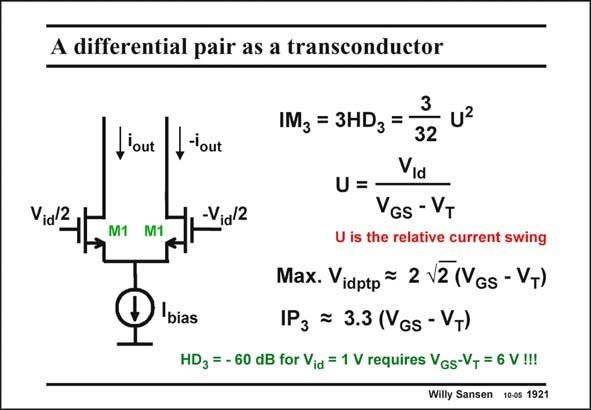

# SANSEN-1921 · A differential pair as a transconductor

章节：19 连续时间滤波器  
PDF 页：566；书本页：577；幻灯片编号：1921  
状态：unreviewed



## 对应教材讲解

### PDF 566 · 书本 577

The simplest transconductor is evidently a differential pair. Its Gm is simply the transconductance of the MOSTs. Its distortion is quite high, however. Its IM 3 is proportional to the relative current swing squared. It can be reduced for large values of V −V . GS T Exceedingly high values are required, however, to achieve low distortion for a 1 V input signal amplitude. Additional feedback or other tricks will therefore be required to remedy this.

## 公式／性能结论候选摘录

以下为规则截取的原文，尚未逐项判读。

- PDF 566: Its IM 3 is proportional to the relative current swing squared.
- PDF 566: Additional feedback or other tricks will therefore be required to remedy this.

## 曲线结论候选摘录

以下为规则截取的原文，尚未逐项判读。

（未由规则找到；不代表原页没有此类内容。）

## 原文条件与近似候选摘录

以下为规则截取的原文，尚未逐项判读。

（未由规则找到；不代表原页没有此类内容。）

## 幻灯片 OCR（未校正）

```text
A differential pair as a transconductor
Vid/2
_'out
M1 M1
3
IM3 = 3HDz =
,-'out
32
Via
U =
-Via/2
VGS - VT
U is the relative current swing
Max. Vidptp = 2 \2 (VGs - VT)
bias
IP3 = 3.3 (VGs - VT)
HD3 = - 60 dB for Vid = 1 V requires VGs-V, = 6 V!!!
Willy Sansen 100s 1921
```

数学上下标、分数及正负号以原图为准。电路图已保留；未核对的连接不输出成可仿真 netlist。
