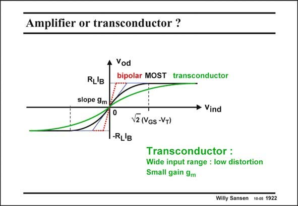

# SANSEN-1922 · Amplifier or transconductor ?

章节：19 连续时间滤波器  
PDF 页：566；书本页：577；幻灯片编号：1922  
状态：unreviewed



## 对应教材讲解

### PDF 566 · 书本 577

To illustrate once more what the difference is between an amplifier and a transconductor, the transfer curve is illustrated for several of them. An amplifier has high gain and a small input range. A bipolar-transistor amplifier is a good example. A transconductor has low gain but a large input range. A MOST amplifier with large V −V values and a GS T bipolar-transistor amplifier with emitter resistors, are good examples. Real transconductors have an even larger input range. Their range is extended by means of linearization techniques such as local feedback and cross-coupling. They are now studied.

## 公式／性能结论候选摘录

以下为规则截取的原文，尚未逐项判读。

- PDF 566: An amplifier has high gain and a small input range.
- PDF 566: A transconductor has low gain but a large input range.

## 曲线结论候选摘录

以下为规则截取的原文，尚未逐项判读。

- PDF 566: To illustrate once more what the difference is between an amplifier and a transconductor, the transfer curve is illustrated for several of them.

## 原文条件与近似候选摘录

以下为规则截取的原文，尚未逐项判读。

（未由规则找到；不代表原页没有此类内容。）

## 幻灯片 OCR（未校正）

```text
Amplifier or transconductor ?
Vod
bipolar MOST transconductor
RL'B
slope 9m
• Vind
-RL'B
V2 (NGS -VT)
Transconductor :
Wide input range : low distortion
Small gain 9m
Willy Sansen 10-0s 1922
```

数学上下标、分数及正负号以原图为准。电路图已保留；未核对的连接不输出成可仿真 netlist。
