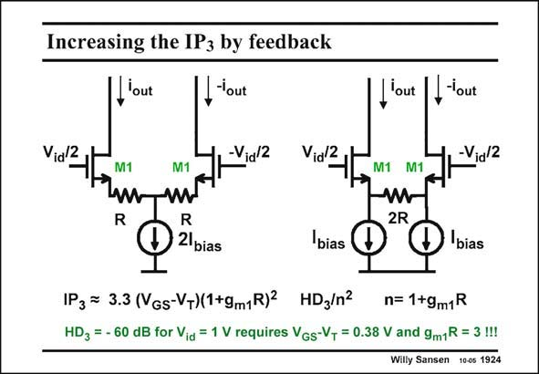

# SANSEN-1924 · Increasing the IP3 by feedback

章节：19 连续时间滤波器  
PDF 页：567；书本页：578；幻灯片编号：1924  
状态：unreviewed



## 对应教材讲解

### PDF 567 · 书本 578

Local feedback is an obvious technique to increase the input range or reduce the distortion (see previous Chapter). Two practical circuits are shown in this slide. They are equivalent for AC performance but not for DC. In the left case the DC currents also flow through the series resistors R, but not in the right case. More DC voltage drop is thus required for the left case. It is to be avoided at low supply voltages. Another difference is that, on the left, the two resistors R must be well matched. On the right the two current sources must also be well matched. Which one is easier depends on the area used. Another difference is that the output capacitance of the current source is connected at a common-mode point on the left. On the right, these output capacitances will limit the highfrequency performance. A small capacitance across 2R may now be needed for compensation. Both circuits have the same reduction in distortion. If more reduction is required, more loop gain is required, as shown next.

## 公式／性能结论候选摘录

以下为规则截取的原文，尚未逐项判读。

- PDF 567: Local feedback is an obvious technique to increase the input range or reduce the distortion (see previous Chapter).
- PDF 567: More DC voltage drop is thus required for the left case.
- PDF 567: Which one is easier depends on the area used.
- PDF 567: On the right, these output capacitances will limit the highfrequency performance.
- PDF 567: If more reduction is required, more loop gain is required, as shown next.

## 曲线结论候选摘录

以下为规则截取的原文，尚未逐项判读。

（未由规则找到；不代表原页没有此类内容。）

## 原文条件与近似候选摘录

以下为规则截取的原文，尚未逐项判读。

（未由规则找到；不代表原页没有此类内容。）

## 幻灯片 OCR（未校正）

```text
Increasing the IP3 by feedback
'out
,-'out
Vial2,
-Vid 2
M1
I'out
'out
-Vid 2
M1
R
Vial2t.
M1 M1
2R
D 2lbias
bias
'bias
IP3 = 3.3 (VGs-V-)(1+9mR)2 HD3/n2
n= 1+9m1R
HD3 = - 60 dB for Vid = 1 V requires VGs-V, = 0.38 V and 9m1R = 3 !!!
Willy Sansen 100s 1924
```

数学上下标、分数及正负号以原图为准。电路图已保留；未核对的连接不输出成可仿真 netlist。
