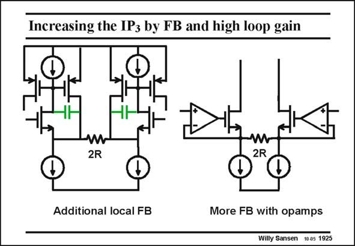

# SANSEN-1925 · Increasing the IP by FB and high loop gain

章节：19 连续时间滤波器  
PDF 页：568；书本页：579；幻灯片编号：1925  
状态：unreviewed



## 对应教材讲解

### PDF 568 · 书本 579

For larger loop gain in the feedback loop, the distortion is lower and the input range larger. Local feedback is possible by addition of only a few transistors as shown on the left. The input transistors cannot have any AC current as they have DC current sources in both Drain and Source. Only the pMOST devices thus carry AC current. This current is determined by the differential input voltage which appears nearly unattenuated across transistor 2R. The output currents are then mirrored out. This voltage-to-current conversion is even more accurate if a full operational amplifier is inserted in the feedback loop, instead of just one single transistor. The loop gain now includes the open-loop gain of the operational amplifier. The distortion will now be very small. This is only true at low frequencies, however, as the open-loop gain of an opamp drops quite rapidly versus frequency. For high frequencies the circuit on the left may be preferable.

## 公式／性能结论候选摘录

以下为规则截取的原文，尚未逐项判读。

- PDF 568: For larger loop gain in the feedback loop, the distortion is lower and the input range larger.
- PDF 568: Only the pMOST devices thus carry AC current.
- PDF 568: The loop gain now includes the open-loop gain of the operational amplifier.
- PDF 568: This is only true at low frequencies, however, as the open-loop gain of an opamp drops quite rapidly versus frequency.

## 曲线结论候选摘录

以下为规则截取的原文，尚未逐项判读。

（未由规则找到；不代表原页没有此类内容。）

## 原文条件与近似候选摘录

以下为规则截取的原文，尚未逐项判读。

（未由规则找到；不代表原页没有此类内容。）

## 幻灯片 OCR（未校正）

```text
Increasing the IP by FB and high loop gain
2R
W
2R
Additional local FB
More FB with opamps
Willy Sansen 10.05 1925
```

数学上下标、分数及正负号以原图为准。电路图已保留；未核对的连接不输出成可仿真 netlist。
