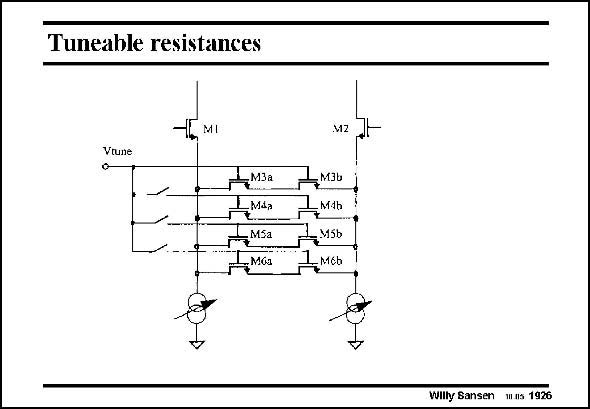

# SANSEN-1926 · Tuneable resistances

章节：19 连续时间滤波器  
PDF 页：568；书本页：579；幻灯片编号：1926  
状态：unreviewed



## 对应教材讲解

### PDF 568 · 书本 579

The previous transconductors all have the disadvantage that they cannot be tuned. Their voltage-to-current conversion is determined by the resistor. The tuneability can be greatly enhanced by insertion of MOSTs as resistors or even better by a bank of MOSTs, which can be switched in and out for coarse tuning. Changing the voltage V , then changes tune the on-resistance of the MOST, for fine tuning.

## 公式／性能结论候选摘录

以下为规则截取的原文，尚未逐项判读。

（未由规则找到；不代表原页没有此类内容。）

## 曲线结论候选摘录

以下为规则截取的原文，尚未逐项判读。

（未由规则找到；不代表原页没有此类内容。）

## 原文条件与近似候选摘录

以下为规则截取的原文，尚未逐项判读。

（未由规则找到；不代表原页没有此类内容。）

## 幻灯片 OCR（未校正）

```text
Tuneable resistances
T4MI
Vrune
ДмЗа
-M4p
-MSa
-- Móa
M2
—мзы
M4b
1-MSb
Дмьы
Wilty Sansen 1115 1926
```

数学上下标、分数及正负号以原图为准。电路图已保留；未核对的连接不输出成可仿真 netlist。
