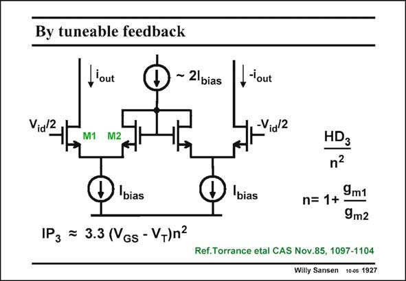

# SANSEN-1927 · By tuneable feedback

章节：19 连续时间滤波器  
PDF 页：569；书本页：580；幻灯片编号：1927  
状态：unreviewed



## 对应教材讲解

### PDF 569 · 书本 580

Rather than use MOSTs as resistors, MOSTs can also be used as diodes, as shown in this slide. The total resistance 2R between the Sources of the input transistors M1 is now 2/g for small signals. This m2 value can be tuned by changing the DC current 2 I through the diode-conbias nected MOSTs M2. Evidently, for small I , bias the resistances are larger and the distortion is reduced. The gain is now smaller as well. This is the situation for large input signal amplitudes. The reduction factor n simply depends on the g ratio and hence on the current ratio. m The IP increases accordingly. 3 Actually, this is a circuit which has been around since the sixties with bipolar transistors. It was used for Automatic Gain Control in some receiver circuits.

## 公式／性能结论候选摘录

以下为规则截取的原文，尚未逐项判读。

- PDF 569: The gain is now smaller as well.
- PDF 569: The reduction factor n simply depends on the g ratio and hence on the current ratio. m The IP increases accordingly. 3 Actually, this is a circuit which has been around since the sixties with bipolar transistors.
- PDF 569: It was used for Automatic Gain Control in some receiver circuits.

## 曲线结论候选摘录

以下为规则截取的原文，尚未逐项判读。

（未由规则找到；不代表原页没有此类内容。）

## 原文条件与近似候选摘录

以下为规则截取的原文，尚未逐项判读。

（未由规则找到；不代表原页没有此类内容。）

## 幻灯片 OCR（未校正）

```text
By tuneable feedback
l'out
~ 21bias
Vidl2
,'out
-Vial2
M1 M2
D
bias
IPz = 3.3 (VGs - V-)n2
bias
HD3
n2
n= 1+9m1
9m2
Ref.Torrance etal CAS Nov.85, 1097-1104
Willy Sansen 10-0s 1927
```

数学上下标、分数及正负号以原图为准。电路图已保留；未核对的连接不输出成可仿真 netlist。
