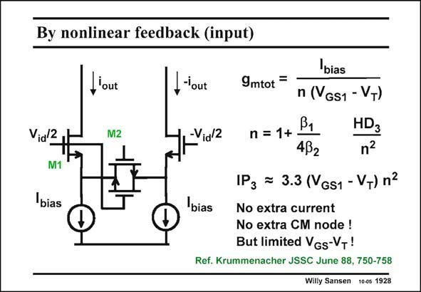

# SANSEN-1928 · By nonlinear feedback (input)

章节：19 连续时间滤波器  
PDF 页：569；书本页：580；幻灯片编号：1928  
状态：unreviewed



## 对应教材讲解

### PDF 569 · 书本 580

A better realization of a transconductor which uses MOSTs as resistances is shown in this slide. It has the advantage that no extra current is consumed. Also, no extra common-mode node is added. The reduction factor n is determined by the ratios of the sizes b /b of the 1 2 nMOST transistors. It appears in the total transconductance g but also mtot in the IP . 3 The optimum ratio b /b 1 2 depends somewhat on the value of V −V chosen. For example, for a V −V of 0.27 V, the GS1 T GS1 T optimum value of the ratio is about 6. The transconductance g is then constant (within 1%) mtot for output currents within 80% of the biasing current I . bias

## 公式／性能结论候选摘录

以下为规则截取的原文，尚未逐项判读。

- PDF 569: It appears in the total transconductance g but also mtot in the IP . 3 The optimum ratio b /b 1 2 depends somewhat on the value of V −V chosen.

## 曲线结论候选摘录

以下为规则截取的原文，尚未逐项判读。

（未由规则找到；不代表原页没有此类内容。）

## 原文条件与近似候选摘录

以下为规则截取的原文，尚未逐项判读。

（未由规则找到；不代表原页没有此类内容。）

## 幻灯片 OCR（未校正）

```text
By nonlinear feedback (input)
,'out
M2
_-'out
-Via/2
Vidl2
M1
lbias
bias
9mtot =
n (VGS1 - VT)
B1
n
1+
HD3
432
1P3 = 3.3 (VGs1 - VT) n2
bias
No extra current
No extra CM node !
But limited VGs-VT!
Ref. Krummenacher JSSC June 88, 750-758
Willy Sansen 10-0s 1928
```

数学上下标、分数及正负号以原图为准。电路图已保留；未核对的连接不输出成可仿真 netlist。
