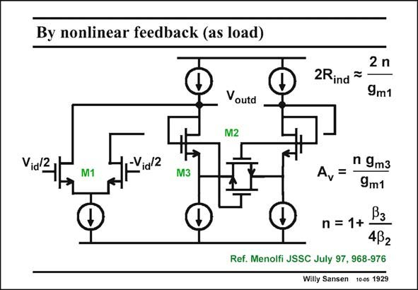

# SANSEN-1929 · By nonlinear feedback (as load)

章节：19 连续时间滤波器  
PDF 页：570；书本页：581；幻灯片编号：1929  
状态：unreviewed



## 对应教材讲解

### PDF 570 · 书本 581

The same linearization technique can be applied to diode-connected transistors, to be used as loads of a differential pair or transconductor. Transistors M3 are linearized indeed by application of linear transistors M2. Again, the ratio of the transistor sizes determines factor n, which at the same time reduces the distortion and increases the differential resistor 2R between the ind Sources of the diode connected devices M3. The total voltage gain A from the differential input v to the differential output v also v id outd increases with factor n.

## 公式／性能结论候选摘录

以下为规则截取的原文，尚未逐项判读。

- PDF 570: Again, the ratio of the transistor sizes determines factor n, which at the same time reduces the distortion and increases the differential resistor 2R between the ind Sources of the diode connected devices M3.
- PDF 570: The total voltage gain A from the differential input v to the differential output v also v id outd increases with factor n.

## 曲线结论候选摘录

以下为规则截取的原文，尚未逐项判读。

（未由规则找到；不代表原页没有此类内容。）

## 原文条件与近似候选摘录

以下为规则截取的原文，尚未逐项判读。

（未由规则找到；不代表原页没有此类内容。）

## 幻灯片 OCR（未校正）

```text
By nonlinear feedback (as load)
2Rind
2 n
9m1
Voutd
M2
Vid/2
-Vid 2
M3
Ay
n 9m3
9m1
Pз
n =
1+
432
Ref. Menolfi JSSC July 97, 968-976
Willy Sansen 10-0s 1929
```

数学上下标、分数及正负号以原图为准。电路图已保留；未核对的连接不输出成可仿真 netlist。
