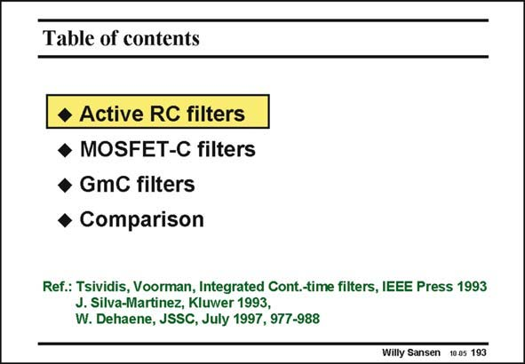

# SANSEN-193 · Table of contents

章节：19 连续时间滤波器  
PDF 页：557；书本页：568；幻灯片编号：193  
状态：unreviewed



## 对应教材讲解

### PDF 557 · 书本 568

Possible solutions are provided by use of RC or MOSFET-C filters. Most attention will be paid to Gm-C filters as they reach the highest frequencies. At the end of this Chapter, a comparison is given of the dynamic ranges that can be expected for different frequency regions.

## 公式／性能结论候选摘录

以下为规则截取的原文，尚未逐项判读。

（未由规则找到；不代表原页没有此类内容。）

## 曲线结论候选摘录

以下为规则截取的原文，尚未逐项判读。

（未由规则找到；不代表原页没有此类内容。）

## 原文条件与近似候选摘录

以下为规则截取的原文，尚未逐项判读。

- PDF 557: Possible solutions are provided by use of RC or MOSFET-C filters.

## 幻灯片 OCR（未校正）

```text
Table of contents
• Active RC filters
• MOSFET-C filters
• GmC filters
• Comparison
Ref.: Tsividis, Voorman, Integrated Cont.-time filters, IEEE Press 1993
J. Silva-Martinez, Kluwer 1993,
W. Dehaene, JSSC, July 1997, 977-988
Willy Sansen 10.05 193
```

数学上下标、分数及正负号以原图为准。电路图已保留；未核对的连接不输出成可仿真 netlist。
