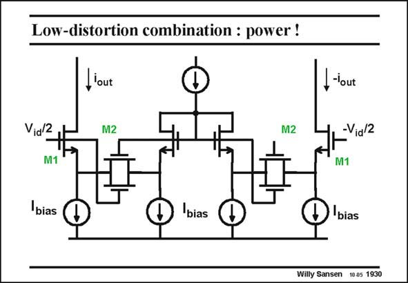

# SANSEN-1930 · Low-distortion combination : power !

章节：19 连续时间滤波器  
PDF 页：570；书本页：581；幻灯片编号：1930  
状态：unreviewed



## 对应教材讲解

### PDF 570 · 书本 581

A combination of both previous techniques leads to the circuit shown in this slide. It combines the advantages of both of them and also the disadvantages. The power consumption is greatly increased and so is the input range.

## 公式／性能结论候选摘录

以下为规则截取的原文，尚未逐项判读。

- PDF 570: The power consumption is greatly increased and so is the input range.

## 曲线结论候选摘录

以下为规则截取的原文，尚未逐项判读。

（未由规则找到；不代表原页没有此类内容。）

## 原文条件与近似候选摘录

以下为规则截取的原文，尚未逐项判读。

（未由规则找到；不代表原页没有此类内容。）

## 幻灯片 OCR（未校正）

```text
Low-distortion combination : power !
lout
Via/2
M1
M2
M2
I-tout
-Via/2
M1
bias
bias
D 'bias
Willy Sansen 10.05 1930
```

数学上下标、分数及正负号以原图为准。电路图已保留；未核对的连接不输出成可仿真 netlist。
