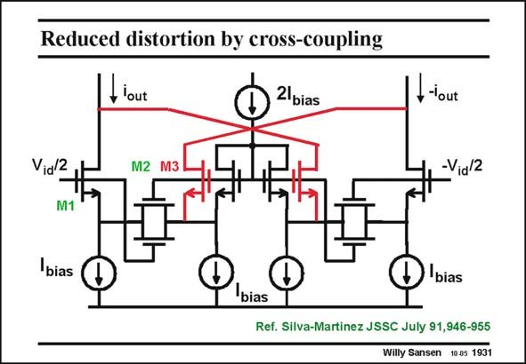

# SANSEN-1931 · Reduced distortion by cross-coupling

章节：19 连续时间滤波器  
PDF 页：571；书本页：582；幻灯片编号：1931  
状态：unreviewed



## 对应教材讲解

### PDF 571 · 书本 582

On top of the two previous techniques, cross-coupling can also be added. As will be shown later in this Chapter, cross-coupling has become an often used technique to reduce the distortion, at the cost of a reduction in output signal amplitude. The combination of these three techniques probably gives the largest possible input voltage range, without using an operational amplifier. The high-frequency performance will be less than for the Krummenacher circuit, but the input range will be larger, for a certain amount of distortion. This is shown next.

## 公式／性能结论候选摘录

以下为规则截取的原文，尚未逐项判读。

（未由规则找到；不代表原页没有此类内容。）

## 曲线结论候选摘录

以下为规则截取的原文，尚未逐项判读。

（未由规则找到；不代表原页没有此类内容。）

## 原文条件与近似候选摘录

以下为规则截取的原文，尚未逐项判读。

（未由规则找到；不代表原页没有此类内容。）

## 幻灯片 OCR（未校正）

```text
Reduced distortion by cross-coupling
t lout
2lbias
I.-lout
Via/2
M1
M2 M3
-Via/2
bias
bias
D
bias
Ref. Silva-Martinez JSSC July 91,946-955
Willy Sansen 10.05 1931
```

数学上下标、分数及正负号以原图为准。电路图已保留；未核对的连接不输出成可仿真 netlist。
