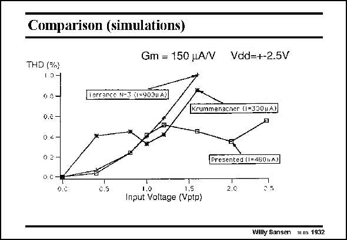

# SANSEN-1932 · Comparison (simulations)

章节：19 连续时间滤波器  
PDF 页：571；书本页：582；幻灯片编号：1932  
状态：unreviewed



## 对应教材讲解

### PDF 571 · 书本 582

This difference in input range is illustrated in this slide. The curve of Torrance is flattened by the feedback resistances made up by the diode-connected transistors. The one of Krummenacher realizes distortion cancellation around 1 V and then ptp increases greatly as the Torrance curve. The one of Silva however, takes the best of both. For low input voltages, it follows the Torrance curve, whereas for high input voltages, it exploits distortion cancellation by both the Krummenacher technique and by cancellation. An input range of 2.5 V is quite large indeed. ptp

## 公式／性能结论候选摘录

以下为规则截取的原文，尚未逐项判读。

- PDF 571: The one of Krummenacher realizes distortion cancellation around 1 V and then ptp increases greatly as the Torrance curve.

## 曲线结论候选摘录

以下为规则截取的原文，尚未逐项判读。

- PDF 571: The curve of Torrance is flattened by the feedback resistances made up by the diode-connected transistors.
- PDF 571: The one of Krummenacher realizes distortion cancellation around 1 V and then ptp increases greatly as the Torrance curve.
- PDF 571: For low input voltages, it follows the Torrance curve, whereas for high input voltages, it exploits distortion cancellation by both the Krummenacher technique and by cancellation.

## 原文条件与近似候选摘录

以下为规则截取的原文，尚未逐项判读。

（未由规则找到；不代表原页没有此类内容。）

## 幻灯片 OCR（未校正）

```text
Comparison (simulations)
Gm = 150 uA/V Vdd=+-2.5V
THD (%)
10-
Torcanco N-X (1=90311 A))
o,e
02-
02
Krummenacher (1=300uA)
o.C
0.5
Presented (1=450nA)
2.0
25
1,0
1.5
Input Voltage (Vptp)
Willy Sansen 115 1932
```

数学上下标、分数及正负号以原图为准。电路图已保留；未核对的连接不输出成可仿真 netlist。
