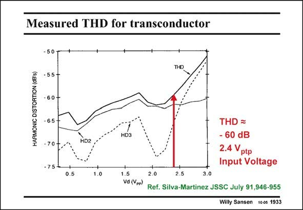

# SANSEN-1933 · Measured THD for transconductor

章节：19 连续时间滤波器  
PDF 页：572；书本页：583；幻灯片编号：1933  
状态：unreviewed



## 对应教材讲解

### PDF 572 · 书本 583

It is clear that from a measurement about 0.1% HD 3 can be achieved for as much as 2.4 V input voltage. ptp For larger input voltages, the distortion increases rapidly, indicating that the region of high distortion is reached. Power series can no longer be used to predict the distortion levels.

## 公式／性能结论候选摘录

以下为规则截取的原文，尚未逐项判读。

- PDF 572: It is clear that from a measurement about 0.1% HD 3 can be achieved for as much as 2.4 V input voltage. ptp For larger input voltages, the distortion increases rapidly, indicating that the region of high distortion is reached.

## 曲线结论候选摘录

以下为规则截取的原文，尚未逐项判读。

（未由规则找到；不代表原页没有此类内容。）

## 原文条件与近似候选摘录

以下为规则截取的原文，尚未逐项判读。

（未由规则找到；不代表原页没有此类内容。）

## 幻灯片 OCR（未校正）

```text
Measured THD for transconductor
HARMONIC DISTORTION (dB's)
55-
HD2
THD =
- 60 dB
2.4 Vptp
Input Voltage
0.5
1.0
1.5
Vd (Vpp)
2.0
2.5
3.0
Ref. Silva-Martinez JSSC July 91,946-955
Willy Sansen 100s 1933
```

数学上下标、分数及正负号以原图为准。电路图已保留；未核对的连接不输出成可仿真 netlist。
