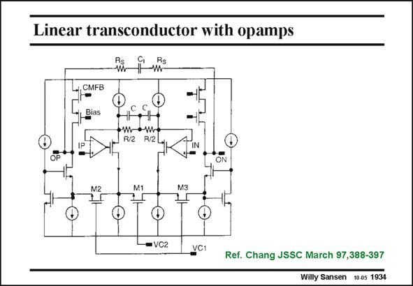

# SANSEN-1934 · Linear transconductor with opamps

章节：19 连续时间滤波器  
PDF 页：572；书本页：583；幻灯片编号：1934  
状态：unreviewed



## 对应教材讲解

### PDF 572 · 书本 583

The lowest distortion can be achieved by insertion of a fully operational amplifier in the feedback loop. Fixed resistors R/2 are used to carry out the voltage-tocurrent conversion. Small capacitances are added in parallel to boost this conversion at higher frequencies. This is necessary as the operational amplifiers have reduced gain at high frequencies. Tuning of the transconductance is possible by changing the control voltages VC1 and VC2, which control the load resistances M1 and M2. This transconductor has actually the structure of a folded cascode. The outputs are taken at the Drains of the regulated cascode stages. With this transconductor a 7th order fully-differential Chebyshev filter has been constructed. It is a bandpass filter which can be tuned from 165 to 505 kHz. The IM is less than −72 dB 3 (at 300 kHz) increasing to less than 61 dB (at 600 kHz). The maximum dynamic range is 75 dB for 0.1% IM at 4 V input voltage. Such large input voltage is only possible with operational 3 ptp amplifiers in the feedback loop. It was realized in 0.7 micron CMOS.

## 公式／性能结论候选摘录

以下为规则截取的原文，尚未逐项判读。

- PDF 572: This is necessary as the operational amplifiers have reduced gain at high frequencies.

## 曲线结论候选摘录

以下为规则截取的原文，尚未逐项判读。

（未由规则找到；不代表原页没有此类内容。）

## 原文条件与近似候选摘录

以下为规则截取的原文，尚未逐项判读。

（未由规则找到；不代表原页没有此类内容。）

## 幻灯片 OCR（未校正）

```text
Linear transconductor with opamps
-, CMFB
Bias
•W—•W
R/2
R/2
IP
M2
M1
= VC2
УС1
Ref. Chang JSSC March 97,388-397
Willy Sansen 10.05 1934
```

数学上下标、分数及正负号以原图为准。电路图已保留；未核对的连接不输出成可仿真 netlist。
