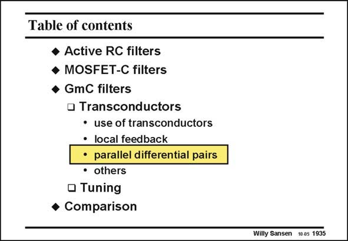

# SANSEN-1935 · Table of contents

章节：19 连续时间滤波器  
PDF 页：573；书本页：584；幻灯片编号：1935  
状态：unreviewed



## 对应教材讲解

### PDF 573 · 书本 584

Both active RC and MOSFET-C filters employ operational amplifiers. This means that only at low frequencies, the loop gain is sufficiently large to guarantee an accurate performance. For high frequency filters, the operational amplifiers are reduced to their simplest possible configurations. They only consist of differential pairs, to which some linearization techniques have been applied. Now some transconductor configurations are discussed, with parallel differential pairs.

## 公式／性能结论候选摘录

以下为规则截取的原文，尚未逐项判读。

- PDF 573: This means that only at low frequencies, the loop gain is sufficiently large to guarantee an accurate performance.

## 曲线结论候选摘录

以下为规则截取的原文，尚未逐项判读。

（未由规则找到；不代表原页没有此类内容。）

## 原文条件与近似候选摘录

以下为规则截取的原文，尚未逐项判读。

（未由规则找到；不代表原页没有此类内容。）

## 幻灯片 OCR（未校正）

```text
Table of contents
• Active RC filters
• MOSFET-C filters
• GmC filters
• Transconductors
• use of transconductors
• local feedback
•parallel differential pairs
• others
• Tuning
• Comparison
Willy Sansen 10.05 1935
```

数学上下标、分数及正负号以原图为准。电路图已保留；未核对的连接不输出成可仿真 netlist。
