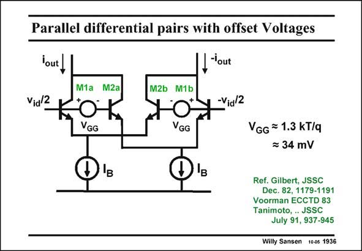

# SANSEN-1936 · Parallel differential pairs with offset Voltages

章节：19 连续时间滤波器  
PDF 页：573；书本页：584；幻灯片编号：1936  
状态：unreviewed



## 对应教材讲解

### PDF 573 · 书本 584

Rather than use feedback by means of local series resistors, differential pairs can be put in parallel, as shown in this slide. The goal is always the same, i.e. to reduce the distortion over a wider input range. An early example with bipolar transistors is given in this slide. Two differential pairs are put in parallel, with equal biasing currents I . An offset voltage V is B GG introduced to move the transfer characteristic of the second differential pair over the input voltage axis, as shown next. Note that the output current i is the sum of the currents of transistors M1a and M2a. The current of this latter transistor out M2a is much smaller than the current through M1a, because of the offset voltage V . The sum GG has a smaller slope over a wider input voltage range. The best result is obtained for an offset voltage of about 34 mV (Ref. Tanimoto). This is explained in more detail next.

## 公式／性能结论候选摘录

以下为规则截取的原文，尚未逐项判读。

- PDF 573: Two differential pairs are put in parallel, with equal biasing currents I .

## 曲线结论候选摘录

以下为规则截取的原文，尚未逐项判读。

- PDF 573: An offset voltage V is B GG introduced to move the transfer characteristic of the second differential pair over the input voltage axis, as shown next.
- PDF 573: The sum GG has a smaller slope over a wider input voltage range.

## 原文条件与近似候选摘录

以下为规则截取的原文，尚未逐项判读。

- PDF 573: The current of this latter transistor out M2a is much smaller than the current through M1a, because of the offset voltage V .

## 幻灯片 OCR（未校正）

```text
Parallel differential pairs with offset Voltages
lout
I-'out
Vid 2
M1a M2a
M2b M1b
KOK
-Vial2
O'E
O'
VGG = 1.3 KT/q
= 34 mV
Ref. Gilbert, JSSC
Dec. 82, 1179-1191
Voorman ECCTD 83
Tanimoto, ...JSSC
July 91, 937-945
Willy Sansen 100s 1936
```

数学上下标、分数及正负号以原图为准。电路图已保留；未核对的连接不输出成可仿真 netlist。
