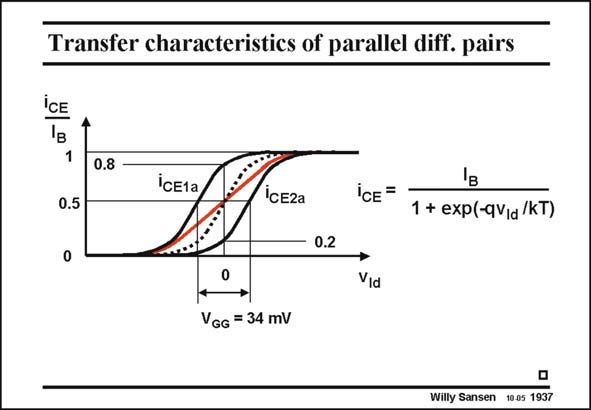

# SANSEN-1937 · Transfer characteristics of parallel diff. pairs

章节：19 连续时间滤波器  
PDF 页：574；书本页：585；幻灯片编号：1937  
状态：unreviewed



## 对应教材讲解

### PDF 574 · 书本 585

The transfer characteristic of a differential pair without offset is given by the expression in this slide and is represented by the dotted line. For zero input voltage v Id the output collector current is half the biasing current I . B For a larger input voltage, the collector current increases until it equals all the biasing current I . B This curve was derived in Chapter 3. If an offset voltage is introduced V , then the GG whole curve shifts over the input voltage axis by exactly this amount V . As a result, the GG current through transistor M1a has increased from 50% to about 80% and has decreased through transistor M2a from 50% to about 20%. The average is again 50%. The transfer characteristic is spread out over a larger range of input voltages however, as shown by the red line. The transconductance is the slope of the current versus input voltage. The transconductance around zero input voltage has decreased. It is almost 36% smaller than if both differential pairs are put in parallel. The input range however, has increased from about 26 mV for one single ptp differential pair to about 78 mV for the same distortion. This is a factor of three better! ptp These offset voltages are not easily introduced. They can be realized by means of resistors and DC current sources (Ref. Gilbert). An easier way is to use different transistor sizes, as shown next.

## 公式／性能结论候选摘录

以下为规则截取的原文，尚未逐项判读。

- PDF 574: B For a larger input voltage, the collector current increases until it equals all the biasing current I .
- PDF 574: As a result, the GG current through transistor M1a has increased from 50% to about 80% and has decreased through transistor M2a from 50% to about 20%.
- PDF 574: The transconductance around zero input voltage has decreased.
- PDF 574: The input range however, has increased from about 26 mV for one single ptp differential pair to about 78 mV for the same distortion.

## 曲线结论候选摘录

以下为规则截取的原文，尚未逐项判读。

- PDF 574: The transfer characteristic of a differential pair without offset is given by the expression in this slide and is represented by the dotted line.
- PDF 574: B This curve was derived in Chapter 3.
- PDF 574: If an offset voltage is introduced V , then the GG whole curve shifts over the input voltage axis by exactly this amount V .
- PDF 574: The transfer characteristic is spread out over a larger range of input voltages however, as shown by the red line.
- PDF 574: The transconductance is the slope of the current versus input voltage.

## 原文条件与近似候选摘录

以下为规则截取的原文，尚未逐项判读。

（未由规则找到；不代表原页没有此类内容。）

## 幻灯片 OCR（未校正）

```text
Transfer characteristics of parallel diff. pairs
iCE
1
0.5
0
0.8
icE1а
IcE2a
iCE =
1 + exp(-qV/a /KT)
- 0.2
Vịa
VGG = 34 mV
Willy Sansen 10.05 1937
```

数学上下标、分数及正负号以原图为准。电路图已保留；未核对的连接不输出成可仿真 netlist。
