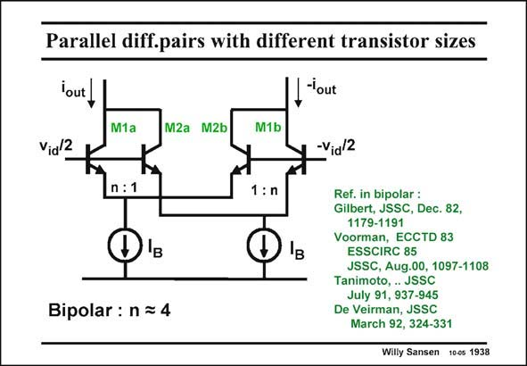

# SANSEN-1938 · Parallel diff.pairs with different transistor sizes

章节：19 连续时间滤波器  
PDF 页：574；书本页：585；幻灯片编号：1938  
状态：unreviewed



## 对应教材讲解

### PDF 574 · 书本 585

The goal is now to realize an offset voltage of about 34 mV between two bipolar transistors, carrying equal currents. Use of the exponential expression of the current I CE versus V shows that a BE ratio in I is required, or in S size, of about 3.7. For simplicity, a factor of four is usually taken. The circuit is shown in this slide. This circuit has been used by many authors. Also a MOST version has been around for quite some time. This will be shown after a few more bipolar realizations.

### PDF 575 · 书本 586

Different values of the biasing currents I can also be used, leading to different values of n. B This will be discussed in more detail for the MOST equivalent.

## 公式／性能结论候选摘录

以下为规则截取的原文，尚未逐项判读。

- PDF 574: The goal is now to realize an offset voltage of about 34 mV between two bipolar transistors, carrying equal currents.

## 曲线结论候选摘录

以下为规则截取的原文，尚未逐项判读。

（未由规则找到；不代表原页没有此类内容。）

## 原文条件与近似候选摘录

以下为规则截取的原文，尚未逐项判读。

（未由规则找到；不代表原页没有此类内容。）

## 幻灯片 OCR（未校正）

```text
Parallel diff.pairs with different transistor sizes
lout
-lout
M1a
M2a M2b
M1b
Vid 2
K
-Via/2
n:1
1:n
Bipolar: n = 4
Ref. in bipolar :
Gilbert, JSSC, Dec. 82,
1179-1191
Voorman, ECCTD 83
ESSCIRC 85
JSSC, Aug.00, 1097-1108
Tanimoto, . JSSC
July 91, 937-945
De Veirman, JSSC
March 92, 324-331
Willy Sansen 10-0s 1938
```

数学上下标、分数及正负号以原图为准。电路图已保留；未核对的连接不输出成可仿真 netlist。
