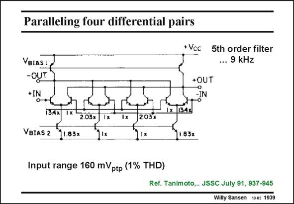

# SANSEN-1939 · Paralleling four differential pairs

章节：19 连续时间滤波器  
PDF 页：575；书本页：586；幻灯片编号：1939  
状态：unreviewed



## 对应教材讲解

### PDF 575 · 书本 586

The same principle can be applied to more than two differential pairs. Four of them are placed in parallel in order to increase the input range. In this example, an input range is obtained of approximately 160 mV , ptp which is about ten times larger than for a single differential pair for the same distortion (0.8% variation in transconductance). The transconductance is reduced to about 35% of the differential pair with the same total current.

## 公式／性能结论候选摘录

以下为规则截取的原文，尚未逐项判读。

- PDF 575: Four of them are placed in parallel in order to increase the input range.

## 曲线结论候选摘录

以下为规则截取的原文，尚未逐项判读。

（未由规则找到；不代表原页没有此类内容。）

## 原文条件与近似候选摘录

以下为规则截取的原文，尚未逐项判读。

- PDF 575: In this example, an input range is obtained of approximately 160 mV , ptp which is about ten times larger than for a single differential pair for the same distortion (0.8% variation in transconductance).

## 幻灯片 OCR（未校正）

```text
Paralleling four differential pairs
+ Vcc
5th order filter
... 9 kHz
VBIASL
-OUT
+IN
+OUT
13.4x
2.03x
2037
VBIAS 2
11.83x
1x 1342
71.83x
Input range 160 mVptp (1% THD)
Ref. Tanimoto,. JSSC July 91, 937-945
Willy Sansen 10.05 1939
```

数学上下标、分数及正负号以原图为准。电路图已保留；未核对的连接不输出成可仿真 netlist。
