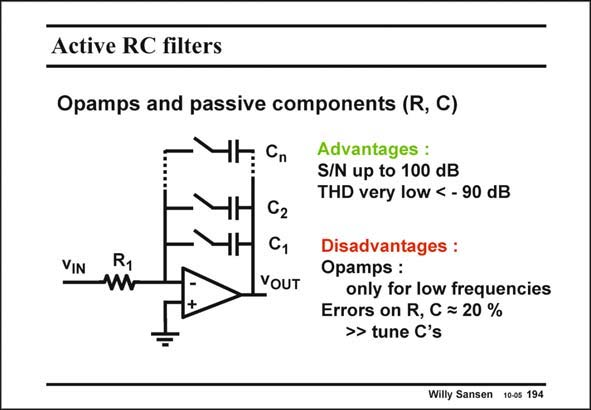

# SANSEN-194 · Active RC filters

章节：19 连续时间滤波器  
PDF 页：557；书本页：568；幻灯片编号：194  
状态：unreviewed



## 对应教材讲解

### PDF 557 · 书本 568

Active RC-filters are operational amplifiers with resistors and capacitors in the feedback loop. If a low-noise opamp is used, large Signal-to-Noise ratios (SNR) can also be achieved, large input signals can be applied with very little distortion. The Signalto-Noise-and Distortion ratio (SNDR) can also be fairly high. Actually, these filters are capable of the highest SNDR values possible, depending on the power consumption. This is obviously only correct for the frequencies where the loop gain is high. These OTA-RC filters are not suitable for high frequencies. Another disadvantage is that passive components are used, which usually have a low absolute

### PDF 558 · 书本 569

accuracies. The absolute errors can be as high as 15 ... 20%. We will therefore need to tune the filter sections. However, in such an OTA-RC filter no component can be tuned. The only way out is to use resistor or capacitor banks, as shown in this slide. For an 8-bitbinary bank of capacitances, the absolute error can be reduced to 0.4%.

## 公式／性能结论候选摘录

以下为规则截取的原文，尚未逐项判读。

- PDF 557: Actually, these filters are capable of the highest SNDR values possible, depending on the power consumption.
- PDF 557: This is obviously only correct for the frequencies where the loop gain is high.
- PDF 558: We will therefore need to tune the filter sections.

## 曲线结论候选摘录

以下为规则截取的原文，尚未逐项判读。

（未由规则找到；不代表原页没有此类内容。）

## 原文条件与近似候选摘录

以下为规则截取的原文，尚未逐项判读。

（未由规则找到；不代表原页没有此类内容。）

## 幻灯片 OCR（未校正）

```text
Active RC filters
Opamps and passive components (R, C)
ЧH Cn
VIN
62
Advantages :
S/N up to 100 dB
THD very low < - 90 dB
W
YOUT
Disadvantages :
Opamps :
only for low frequencies
Errors on R, C = 20 %
>> tune C's
Willy Sansen 100s 194
```

数学上下标、分数及正负号以原图为准。电路图已保留；未核对的连接不输出成可仿真 netlist。
