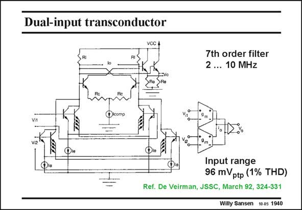

# SANSEN-1940 · Dual-input transconductor

章节：19 连续时间滤波器  
PDF 页：575；书本页：586；幻灯片编号：1940  
状态：unreviewed



## 对应教材讲解

### PDF 575 · 书本 586

The same input arrangements are used for the two parallel transconductors illustrated in this slide. Again, a factor of n=4 is taken for an equal biasing currents I . e The resulting transconductance is now 36% less than the transconductance of a differential pair with the same total current. The input range is about three times higher. In order to increase the gain, a negative resistance is introduced at the output to cancel out the output resistances. The negative resistance is about −2R (see Chapter 3). c

## 公式／性能结论候选摘录

以下为规则截取的原文，尚未逐项判读。

- PDF 575: Again, a factor of n=4 is taken for an equal biasing currents I . e The resulting transconductance is now 36% less than the transconductance of a differential pair with the same total current.
- PDF 575: In order to increase the gain, a negative resistance is introduced at the output to cancel out the output resistances.

## 曲线结论候选摘录

以下为规则截取的原文，尚未逐项判读。

（未由规则找到；不代表原页没有此类内容。）

## 原文条件与近似候选摘录

以下为规则截取的原文，尚未逐项判读。

（未由规则找到；不代表原页没有此类内容。）

## 幻灯片 OCR（未校正）

```text
Dual-input transconductor
7th order filter
2 ... 10 MHz
Input range
96 mVptp (1% THD)
Ref. De Veirman, JSSC, March 92, 324-331
Willy Sansen 10.05 1940
```

数学上下标、分数及正负号以原图为准。电路图已保留；未核对的连接不输出成可仿真 netlist。
