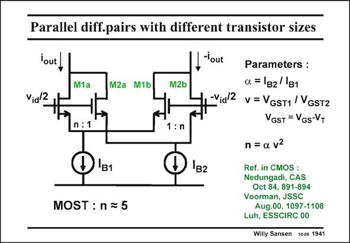

# SANSEN-1941 · Parallel diff.pairs with different transistor sizes

章节：19 连续时间滤波器  
PDF 页：576；书本页：587；幻灯片编号：1941  
状态：unreviewed



## 对应教材讲解

### PDF 576 · 书本 587

The same circuit is easily realized by means of MOSTs as shown in this slide. The optimum value of n however, depends on the square-law characteristic of the MOST. Also, different biasing currents I are nor- B mally used. Their ratio is a. Factor n is usually about 5 for MOST. The values of the biasing currents and the V −V now have to be GS T chosen accordingly, as given in this slide. For equal biasing currents (a=1) the ratio in the V −V value is about 2.24. Values of V −V can now be 0.2 V for transistors M1 and GS T GS T 0.48 V for the inner devices M2.

## 公式／性能结论候选摘录

以下为规则截取的原文，尚未逐项判读。

- PDF 576: The optimum value of n however, depends on the square-law characteristic of the MOST.
- PDF 576: For equal biasing currents (a=1) the ratio in the V −V value is about 2.24.

## 曲线结论候选摘录

以下为规则截取的原文，尚未逐项判读。

- PDF 576: The optimum value of n however, depends on the square-law characteristic of the MOST.

## 原文条件与近似候选摘录

以下为规则截取的原文，尚未逐项判读。

（未由规则找到；不代表原页没有此类内容。）

## 幻灯片 OCR（未校正）

```text
Parallel diff.pairs with different transistor sizes
lout
-lout
M1a
M2a M1b
M2b
Vid 2
-Via/2
n:1
1:n
B1
B2
MOST : n = 5
Parameters :
a = B2 B1
v = VGST1 /VGsT2
VGST = VGs-VT
n = a v2
Ref. in CMOS :
Nedungadi, CAS
Oct 84, 891-894
Voorman, JSSC
Aug.00, 1097-1108
Luh, ESSCIRC 00
Willy Sansen 10-0s 1941
```

数学上下标、分数及正负号以原图为准。电路图已保留；未核对的连接不输出成可仿真 netlist。
