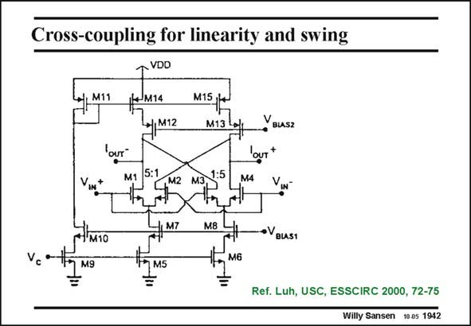

# SANSEN-1942 · Cross-coupling for linearity and swing

章节：19 连续时间滤波器  
PDF 页：576；书本页：587；幻灯片编号：1942  
状态：unreviewed



## 对应教材讲解

### PDF 576 · 书本 587

An example of such a realization is shown in this slide. The factor n is 5 indeed. Equal biasing currents are used.

## 公式／性能结论候选摘录

以下为规则截取的原文，尚未逐项判读。

- PDF 576: Equal biasing currents are used.

## 曲线结论候选摘录

以下为规则截取的原文，尚未逐项判读。

（未由规则找到；不代表原页没有此类内容。）

## 原文条件与近似候选摘录

以下为规则截取的原文，尚未逐项判读。

（未由规则找到；不代表原页没有此类内容。）

## 幻灯片 OCR（未校正）

```text
Cross-coupling for linearity and swing
VDD
111
M14
M12
M15,
M13
YBUSZ
our
5:1
M1
M2
1:5
M3)
M4
M10
•VBLAS1
M6
M5
Ref. Luh, USC, ESSCIRC 2000, 72-75
Willy Sansen 10.05 1942
```

数学上下标、分数及正负号以原图为准。电路图已保留；未核对的连接不输出成可仿真 netlist。
