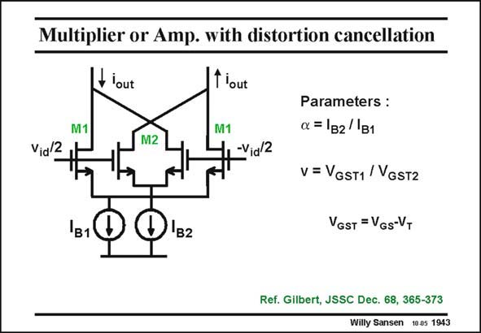

# SANSEN-1943 · Multiplier or Amp. with distortion cancellation

章节：19 连续时间滤波器  
PDF 页：577；书本页：588；幻灯片编号：1943  
状态：unreviewed



## 对应教材讲解

### PDF 577 · 书本 588

Note that all previous transconductors have their outputs connected in a different way compared to multipliers. In multipliers which have been common in bipolar technologies since the sixties, the biasing currents I B1 and I are equal and all B2 transistors have the same size (or V −V ). As a GS T result, the differential output current is always zero, even for a non-zero input voltage v . id Only a difference in biasing current AND differential input voltage v can give a contribution id to the output. A similar configuration is used to cancel out the third harmonic distortion, as shown in the previous Chapter. For a certain relationship, the two parameters a and v, the IM cancels out. 3

## 公式／性能结论候选摘录

以下为规则截取的原文，尚未逐项判读。

- PDF 577: In multipliers which have been common in bipolar technologies since the sixties, the biasing currents I B1 and I are equal and all B2 transistors have the same size (or V −V ).

## 曲线结论候选摘录

以下为规则截取的原文，尚未逐项判读。

（未由规则找到；不代表原页没有此类内容。）

## 原文条件与近似候选摘录

以下为规则截取的原文，尚未逐项判读。

（未由规则找到；不代表原页没有此类内容。）

## 幻灯片 OCR（未校正）

```text
Multiplier or Amp. with distortion cancellation
flout
M1
f'out
M1
M2
Via 2
-Vig/2
B1
1B2
Parameters :
a=|в2/|B1
v = VGsT1 / VGsT2
VGST = VGs-VT
Ref. Gilbert, JSSC Dec. 68, 365-373
Willy Sansen 10.05 1943
```

数学上下标、分数及正负号以原图为准。电路图已保留；未核对的连接不输出成可仿真 netlist。
