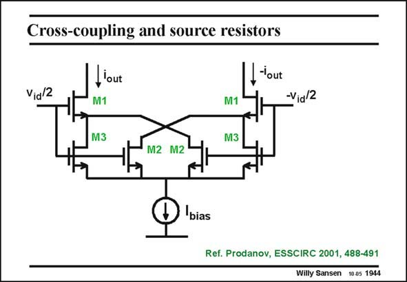

# SANSEN-1944 · Cross-coupling and source resistors

章节：19 连续时间滤波器  
PDF 页：577；书本页：588；幻灯片编号：1944  
状态：unreviewed



## 对应教材讲解

### PDF 577 · 书本 588

All previous transconductors use two (or more) differential pairs to increase the input voltage range. Cross-coupling of the output Drains allows linearization of the total output current, which leads to a constant transconductance over a wider input range. Cross-coupling can also be used in single differential pairs to improve the input range. The first example uses MOSTs M3 as series resistances for the input transistors M1. These MOSTs M3 drive a cross-coupled pair which increases the input voltage range. Another example is given next.

## 公式／性能结论候选摘录

以下为规则截取的原文，尚未逐项判读。

- PDF 577: All previous transconductors use two (or more) differential pairs to increase the input voltage range.
- PDF 577: These MOSTs M3 drive a cross-coupled pair which increases the input voltage range.

## 曲线结论候选摘录

以下为规则截取的原文，尚未逐项判读。

（未由规则找到；不代表原页没有此类内容。）

## 原文条件与近似候选摘录

以下为规则截取的原文，尚未逐项判读。

（未由规则找到；不代表原页没有此类内容。）

## 幻灯片 OCR（未校正）

```text
Cross-coupling and source resistors
Vid/2
lout
M1
-'out
M1
-Vid/2
M3
M3
M2 M2
bias
Ref. Prodanov, ESSCIRC 2001, 488-491
Willy Sansen 10.05 1944
```

数学上下标、分数及正负号以原图为准。电路图已保留；未核对的连接不输出成可仿真 netlist。
