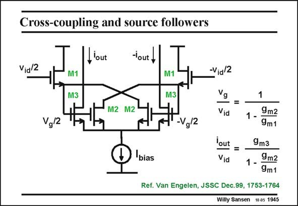

# SANSEN-1945 · Cross-coupling and source followers

章节：19 连续时间滤波器  
PDF 页：578；书本页：589；幻灯片编号：1945  
状态：unreviewed



## 对应教材讲解

### PDF 578 · 书本 589

In this transconductor, cross-coupling is used but also source-followers at the input. The negative resistance −1/g created m2 by the transistors M2, is subtracted from the positive output resistance 1/g of m1 the input source followers M1, such that gain is achieved at the Gates of the transistors M2/M3. This gain is given by ratio v /v . g id The ratio of the transconductances g /g is the m3 m2 same as the ratio of their W/L ratios as their V values are the same. The signal output current is therefore determined GS by the g , multiplied by that same gain factor. m3 This transconductor has high gain and is at the same time very linear, because two V are GS put in series. Also, it has excellent high-frequency performance as only one node is added, i.e. at the output of the input Source followers. Remember, that output resistances of Source followers are usually 1/g and therefore low. m

## 公式／性能结论候选摘录

以下为规则截取的原文，尚未逐项判读。

- PDF 578: The negative resistance −1/g created m2 by the transistors M2, is subtracted from the positive output resistance 1/g of m1 the input source followers M1, such that gain is achieved at the Gates of the transistors M2/M3.
- PDF 578: This gain is given by ratio v /v . g id The ratio of the transconductances g /g is the m3 m2 same as the ratio of their W/L ratios as their V values are the same.
- PDF 578: The signal output current is therefore determined GS by the g , multiplied by that same gain factor. m3 This transconductor has high gain and is at the same time very linear, because two V are GS put in series.
- PDF 578: Remember, that output resistances of Source followers are usually 1/g and therefore low. m

## 曲线结论候选摘录

以下为规则截取的原文，尚未逐项判读。

（未由规则找到；不代表原页没有此类内容。）

## 原文条件与近似候选摘录

以下为规则截取的原文，尚未逐项判读。

（未由规则找到；不代表原页没有此类内容。）

## 幻灯片 OCR（未校正）

```text
Cross-coupling and source followers
lout
lout,
Vid/2
M1
M3
M2 M2
Vg/2
M1
-Vid/2
M3
-Vg/2
Vg
Vid
1
1 -
9m2
9m1
bias
'out
=
Vid
9m3
1 -
9m2
9m1
Ref. Van Engelen, JSSC Dec.99, 1753-1764
Willy Sansen 10.05 1945
```

数学上下标、分数及正负号以原图为准。电路图已保留；未核对的连接不输出成可仿真 netlist。
