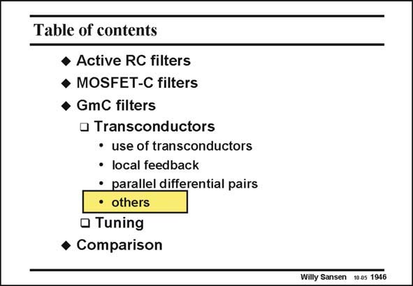

# SANSEN-1946 · Table of contents

章节：19 连续时间滤波器  
PDF 页：578；书本页：589；幻灯片编号：1946  
状态：unreviewed



## 对应教材讲解

### PDF 578 · 书本 589

Not all transconductors use either feedback or crosscoupling. Some others exploit the inherent linear relationship of a CMOS inverter amplifier. The advantage is that they do not add any more nodes. They are capable of veryhigh-frequency performance. A few examples are given next.

## 公式／性能结论候选摘录

以下为规则截取的原文，尚未逐项判读。

（未由规则找到；不代表原页没有此类内容。）

## 曲线结论候选摘录

以下为规则截取的原文，尚未逐项判读。

（未由规则找到；不代表原页没有此类内容。）

## 原文条件与近似候选摘录

以下为规则截取的原文，尚未逐项判读。

（未由规则找到；不代表原页没有此类内容。）

## 幻灯片 OCR（未校正）

```text
Table of contents
• Active RC filters
• MOSFET-C filters
• GmC filters
• Transconductors
• use of transconductors
• local feedback
• parallel differential pairs
•others
• Tuning
• Comparison
Willy Sansen 1005 1946
```

数学上下标、分数及正负号以原图为准。电路图已保留；未核对的连接不输出成可仿真 netlist。
