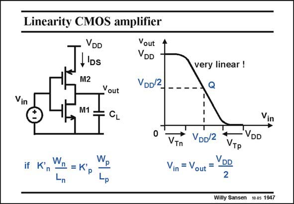

# SANSEN-1947 · Linearity CMOS amplifier

章节：19 连续时间滤波器  
PDF 页：579；书本页：590；幻灯片编号：1947  
状态：unreviewed



## 对应教材讲解

### PDF 579 · 书本 590

Recall from Chapter 3 that a CMOS inverter amplifier is very linear around the quiescent operating point Q. From this region both transistors operate in saturation and exhibit the same square-law relationship. This non-linearity cancels out. The input range is now the supply voltage V DD minus the two threshold voltages V and V . It can Tn Tp be quite large. The linear output voltage range is the supply voltage V minus the two threshold voltages V (which is close to V −V ) DD DSsatn GS T and V . DSsatp

## 公式／性能结论候选摘录

以下为规则截取的原文，尚未逐项判读。

（未由规则找到；不代表原页没有此类内容。）

## 曲线结论候选摘录

以下为规则截取的原文，尚未逐项判读。

（未由规则找到；不代表原页没有此类内容。）

## 原文条件与近似候选摘录

以下为规则截取的原文，尚未逐项判读。

- PDF 579: From this region both transistors operate in saturation and exhibit the same square-law relationship.

## 幻灯片 OCR（未校正）

```text
Vin
Linearity CMOS amplifier
VDD
H'os
Vout
VDD
M2
Vout
M1
CL
VDD2
very linear !
Q
Vin
if Kn
Wn = K'p
Wp
VTn
Vin = Vout
VDD/2
VDD
VTP
VDD
2
Willy Sansen 10.05 1947
```

数学上下标、分数及正负号以原图为准。电路图已保留；未核对的连接不输出成可仿真 netlist。
