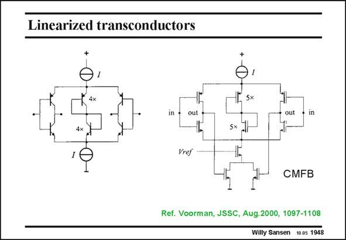

# SANSEN-1948 · Linearized transconductors

章节：19 连续时间滤波器  
PDF 页：579；书本页：590；幻灯片编号：1948  
状态：unreviewed



## 对应教材讲解

### PDF 579 · 书本 590

Two such inverter amplifiers are used for differential operation as shown in this slide. Both a bipolar and a CMOS version are shown. The tuning is carried out by current I. In the bipolar one (on the left) the common-mode current through the diodes in the middle is four times larger than any other inverter branch. It is a differential circuit, as each change of current in one inverter causes the opposite current in the other inverter. The CMOS realization (on the right), is very similar. CMFB is used to avoid common-mode offset caused by the mismatch between the top and bottom current sources I. In both realizations, the equivalent input noise is quite low as only the four input transistors contribute to it.

## 公式／性能结论候选摘录

以下为规则截取的原文，尚未逐项判读。

（未由规则找到；不代表原页没有此类内容。）

## 曲线结论候选摘录

以下为规则截取的原文，尚未逐项判读。

（未由规则找到；不代表原页没有此类内容。）

## 原文条件与近似候选摘录

以下为规则截取的原文，尚未逐项判读。

（未由规则找到；不代表原页没有此类内容。）

## 幻灯片 OCR（未校正）

```text
Linearized transconductors
5x
in •
•in
Sx.
Vrej
CMFB
Ref. Voorman, JSSC, Aug.2000, 1097-1108
Willy Sansen 10.05 1948
```

数学上下标、分数及正负号以原图为准。电路图已保留；未核对的连接不输出成可仿真 netlist。
