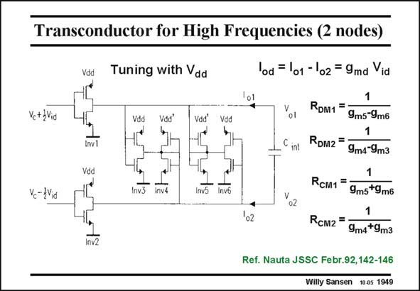

# SANSEN-1949 · Transconductor for High Frequencies (2 nodes)

章节：19 连续时间滤波器  
PDF 页：580；书本页：591；幻灯片编号：1949  
状态：unreviewed



## 对应教材讲解

### PDF 579 · 书本 590

Similar CMOS inverters are used in the transconductor shown in this slide. It is a pseudodifferential realization as a change in current in one inverter does not cause an opposite change of current in the other inverter. They have to be driven in a differential way.

### PDF 580 · 书本 591

The differential resistive load R for the top DM1 inverter Inv1 are the two diode-connected MOSTs of Inv5 and a contribution from the output of the other inverter Inv2 through inverter Inv6. If all g ’s are m the same, this differential resistive load is very large, providing a very large differential gain. The same is true for the resistive load R of the bottom DM2 inverter Inv2. The average or commonmode output resistance R with respect to ground is low on the other hand. Indeed, R equals the sum of the CM1 CM1 transconductances of Inv5 and Inv6. This also applies to R . CM2 This transconductor has the advantage that the differential gain is high. It can be tuned by changing the supply voltages V . The common-mode gain is low however, because the commondd mode output resistances are low. Parasitic capacitances at the output nodes are of little importance. Moreover, this circuit has only an input and output node. It is capable of a very-highfrequency performance.

## 公式／性能结论候选摘录

以下为规则截取的原文，尚未逐项判读。

- PDF 580: If all g ’s are m the same, this differential resistive load is very large, providing a very large differential gain.
- PDF 580: Indeed, R equals the sum of the CM1 CM1 transconductances of Inv5 and Inv6.
- PDF 580: CM2 This transconductor has the advantage that the differential gain is high.
- PDF 580: The common-mode gain is low however, because the commondd mode output resistances are low.

## 曲线结论候选摘录

以下为规则截取的原文，尚未逐项判读。

（未由规则找到；不代表原页没有此类内容。）

## 原文条件与近似候选摘录

以下为规则截取的原文，尚未逐项判读。

（未由规则找到；不代表原页没有此类内容。）

## 幻灯片 OCR（未校正）

```text
Transconductor for High Frequencies (2 nodes)
Vc+}Vid
Vc-WVid
Vdd
lod = 101 - 102 = 9md Via
Tuning with Vad
1
Vdd
Vdd'
Vdd
Vdd
int
Inv3
RDM1 =
9m5-9m6
1
RDM2 =
9m4-9m3
1
RcM1 =
9ms*9ms
o2
'02
RcM2 =
9m4*9m3
Ref. Nauta JSSC Febr.92,142-146
Willy Sansen 10.05 1949
```

数学上下标、分数及正负号以原图为准。电路图已保留；未核对的连接不输出成可仿真 netlist。
