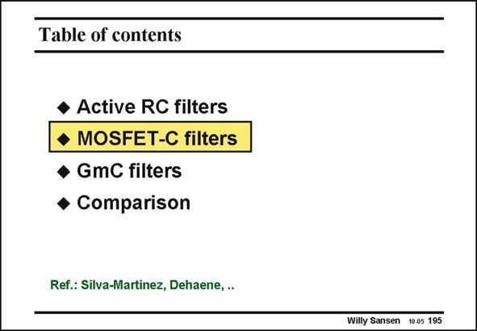

# SANSEN-195 · Table of contents

章节：19 连续时间滤波器  
PDF 页：558；书本页：569；幻灯片编号：195  
状态：unreviewed



## 对应教材讲解

### PDF 558 · 书本 569

Tuning is possible when the resistors are substituted by MOST devices. They are used in the linear region (for small V ) and can be repre- DS sented by their on-resistance (see Chapter 1). Changing the Gate voltage changes their on-resistance, allowing tuning of the filter RC time constants.

## 公式／性能结论候选摘录

以下为规则截取的原文，尚未逐项判读。

（未由规则找到；不代表原页没有此类内容。）

## 曲线结论候选摘录

以下为规则截取的原文，尚未逐项判读。

（未由规则找到；不代表原页没有此类内容。）

## 原文条件与近似候选摘录

以下为规则截取的原文，尚未逐项判读。

（未由规则找到；不代表原页没有此类内容。）

## 幻灯片 OCR（未校正）

```text
Table of contents
• Active RC filters
• MOSFET-C filters
• GmC filters
• Comparison
Ref.: Silva-Martinez, Dehaene, ..
Willy Sansen 10.05 195
```

数学上下标、分数及正负号以原图为准。电路图已保留；未核对的连接不输出成可仿真 netlist。
