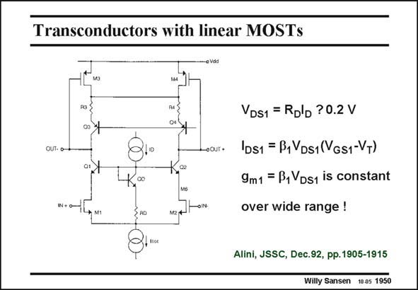

# SANSEN-1950 · Transconductors with linear MOSTs

章节：19 连续时间滤波器  
PDF 页：580；书本页：591；幻灯片编号：1950  
状态：unreviewed



## 对应教材讲解

### PDF 580 · 书本 591

A different way of reducing the distortion of a differential pair and increasing the input range is to bias the input transistors themselves in the linear region, as shown in this slide. For this purpose, the voltage V across the input DS1 MOSTs must be kept constant. A typical value is 0.2 V. The transconductance g m is then constant as well. It can be tuned by changing the value of V or cur- DS1 rent I . D The circuit to keep V constant is quite simple indeed. Biasing (or tuning) current I creates DS1 D a constant voltage R I across resistor R . This voltage imposes the same voltage across the D D D input MOSTs, as all three bipolar transistors Q1, Q2 and QD have similar V values. BE

### PDF 581 · 书本 592

The main disadvantage is that MOSTs in the linear region exhibit lower values of transconductance. Local feedback by means of series resistance in the Source also reduces the transconductance. It is not that obvious which way is more efficient to reduce distortion or to increase the input voltage range.

## 公式／性能结论候选摘录

以下为规则截取的原文，尚未逐项判读。

- PDF 581: It is not that obvious which way is more efficient to reduce distortion or to increase the input voltage range.

## 曲线结论候选摘录

以下为规则截取的原文，尚未逐项判读。

（未由规则找到；不代表原页没有此类内容。）

## 原文条件与近似候选摘录

以下为规则截取的原文，尚未逐项判读。

（未由规则找到；不代表原页没有此类内容。）

## 幻灯片 OCR（未校正）

```text
Transconductors with linear MOSTs
OUT• 0-
-OUT •
02
co
VDS1 = Ro'b ?0.2 V
IDS1 = B1VDs1(VGs1-VT)
9m1 = B1 Ds1 is constant
over wide range !
M1
Alini, JSSC, Dec.92, pp. 1905-1915
Willy Sansen 10.05 1950
```

数学上下标、分数及正负号以原图为准。电路图已保留；未核对的连接不输出成可仿真 netlist。
