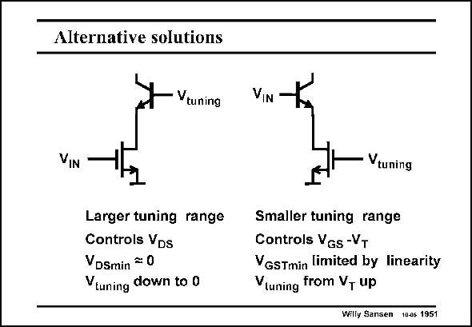

# SANSEN-1951 · Alternative solutions

章节：19 连续时间滤波器  
PDF 页：581；书本页：592；幻灯片编号：1951  
状态：unreviewed



## 对应教材讲解

### PDF 581 · 书本 592

Indeed, a comparison of both alternatives leads to some more insight. On the left, one side of the input stage is depicted of the previous transconductor. A MOST is used as an input device in the linear region, to avoid distortion, at the cost of reduced transconductance. Tuning is carried out by changing the VDS across the input MOST. On the right side, the input device is a (bipolar) amplifier with a series resistor in its Emitter to reduce the distortion and to increase the input voltage range. Tuning is now carried out by changing the value of the MOST Emitter resistance. Which is better in the reduction of the distortion or in the extension of the input voltage range is not obvious. The one on the left has certainly a larger tuning range.

## 公式／性能结论候选摘录

以下为规则截取的原文，尚未逐项判读。

- PDF 581: On the right side, the input device is a (bipolar) amplifier with a series resistor in its Emitter to reduce the distortion and to increase the input voltage range.

## 曲线结论候选摘录

以下为规则截取的原文，尚未逐项判读。

（未由规则找到；不代表原页没有此类内容。）

## 原文条件与近似候选摘录

以下为规则截取的原文，尚未逐项判读。

（未由规则找到；不代表原页没有此类内容。）

## 幻灯片 OCR（未校正）

```text
Alternative solutions
Vtuning
VIN
Larger tuning range
Controls VDs
VDSmin = 0
Vluning down to 0
VIN
Vtuning
Smaller tuning range
Controls VGs-VT
VGSTmin limited by linearity
tuning from V, up
Willy Sansen 1046 1951
```

数学上下标、分数及正负号以原图为准。电路图已保留；未核对的连接不输出成可仿真 netlist。
