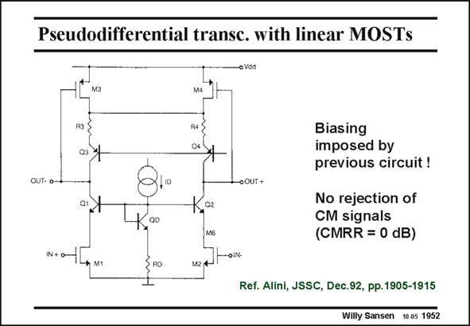

# SANSEN-1952 · Pseudodifferential transc. with linear MOSTs

章节：19 连续时间滤波器  
PDF 页：581；书本页：592；幻灯片编号：1952  
状态：unreviewed



## 对应教材讲解

### PDF 581 · 书本 592

A pseudo-differential realization of the same transconductor is shown in this slide. The current source is left out. As a result, the minimum supply voltage can be smaller by one V DSsat or about 0.2 V. The disadvantage however, is that this circuit must be driven in a differential way. Moreover the average (or common-mode) input voltage determines the DC currents in this circuit. The common-mode biasing is imposed by the previous circuit, which is not shown here!

## 公式／性能结论候选摘录

以下为规则截取的原文，尚未逐项判读。

- PDF 581: As a result, the minimum supply voltage can be smaller by one V DSsat or about 0.2 V.

## 曲线结论候选摘录

以下为规则截取的原文，尚未逐项判读。

（未由规则找到；不代表原页没有此类内容。）

## 原文条件与近似候选摘录

以下为规则截取的原文，尚未逐项判读。

（未由规则找到；不代表原页没有此类内容。）

## 幻灯片 OCR（未校正）

```text
Pseudodifferential transc. with linear MOSTs
03
OUT- о-
•OUT+
OD
02
M6
Biasing
imposed by
previous circuit !
No rejection of
CM signals
(CMRR = 0 dB)
RO
Ref. Alini, JSSC, Dec.92, pp.1905-1915
Willy Sansen 10.05 1952
```

数学上下标、分数及正负号以原图为准。电路图已保留；未核对的连接不输出成可仿真 netlist。
