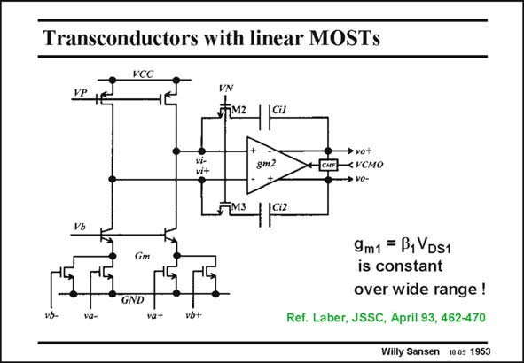

# SANSEN-1953 · Transconductors with linear MOSTs

章节：19 连续时间滤波器  
PDF 页：582；书本页：593；幻灯片编号：1953  
状态：unreviewed



## 对应教材讲解

### PDF 582 · 书本 593

Another example of a transconductor which uses MOSTs in the linear region at the input is shown in this slide. It also has a pseudodifferential input. The cascode biasing voltage V is sufficiently low to b keep all input devices in the linear region. MOSTs in the linear region are also used as feedback resistors across the differential opamp. Tuning is therefore carried out by means of tuning voltage VN.

## 公式／性能结论候选摘录

以下为规则截取的原文，尚未逐项判读。

- PDF 582: Tuning is therefore carried out by means of tuning voltage VN.

## 曲线结论候选摘录

以下为规则截取的原文，尚未逐项判读。

（未由规则找到；不代表原页没有此类内容。）

## 原文条件与近似候选摘录

以下为规则截取的原文，尚未逐项判读。

（未由规则找到；不代表原页没有此类内容。）

## 幻灯片 OCR（未校正）

```text
Transconductors with linear MOSTs
VCC
VN
FM2
vi-
vi+
gm2
→ vo+
Ном<УсмO
→ vo-
Gm
GND
va-
va+
vb+
9m1 = B1 VDS1
is constant
over wide range !
Ref. Laber, JSSC, April 93, 462-470
Willy Sansen 10.05 1953
```

数学上下标、分数及正负号以原图为准。电路图已保留；未核对的连接不输出成可仿真 netlist。
