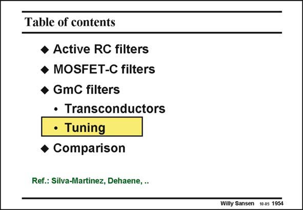

# SANSEN-1954 · Table of contents

章节：19 连续时间滤波器  
PDF 页：582；书本页：593；幻灯片编号：1954  
状态：unreviewed



## 对应教材讲解

### PDF 582 · 书本 593

All previous transconductors can be tuned by changing a biasing current or voltage. This allows tuning of the transconductance such that the time constant of the transconductor is accurately determined. This is the only way to be able to realize higher-order filters. Such circuits are discussed next.

## 公式／性能结论候选摘录

以下为规则截取的原文，尚未逐项判读。

（未由规则找到；不代表原页没有此类内容。）

## 曲线结论候选摘录

以下为规则截取的原文，尚未逐项判读。

（未由规则找到；不代表原页没有此类内容。）

## 原文条件与近似候选摘录

以下为规则截取的原文，尚未逐项判读。

（未由规则找到；不代表原页没有此类内容。）

## 幻灯片 OCR（未校正）

```text
Table of contents
• Active RC filters
• MOSFET-C filters
• GmC filters
• Transconductors
• Tuning
• Comparison
Ref.: Silva-Martinez, Dehaene, ..
Willy Sansen 10.05 1954
```

数学上下标、分数及正负号以原图为准。电路图已保留；未核对的连接不输出成可仿真 netlist。
