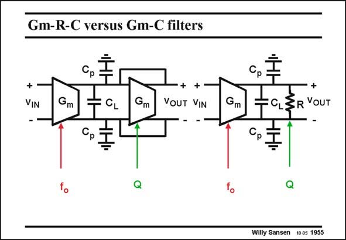

# SANSEN-1955 · Gm-R-C versus Gm-C filters

章节：19 连续时间滤波器  
PDF 页：583；书本页：594；幻灯片编号：1955  
状态：unreviewed



## 对应教材讲解

### PDF 582 · 书本 593

Filters are constructed by putting a number of transconductors in series or in a feedback loop. At the beginning of this Section on Transconductors a good example is given of a biquad consisting of four transconductors. The characteristic frequencies of such a filter are determined by the Gm/C ratios. In order to be able to match these frequencies, accurate values of Gm must be achieved. Indeed, accurate ratios of capacitances are already available (see Chapter 15). The ratios have to be realized between the load capacitances C of several Gm blocks. The parasitic capacitances C will render L p these ratios less accurate. This is compensated however, by adjusting the Gm values.

### PDF 583 · 书本 594

This accuracy can be achieved by adding another Gm block, which is matched to the ones used in the filter, this is tuned to a reference by a tuning circuit. Such circuits will be described next. It is clear however, that besides the characteristic frequency f , sometimes o tuning is required of a quality factor Q as well. This can be done in two ways, either by adjusting the Gm of the diode-connected block (shown left) or by insertion of a tunable damping resistor R (shown right). The latter one is called the Gm-RC filter. The resistor R must have high values and be tunable over a wide range.

## 公式／性能结论候选摘录

以下为规则截取的原文，尚未逐项判读。

（未由规则找到；不代表原页没有此类内容。）

## 曲线结论候选摘录

以下为规则截取的原文，尚未逐项判读。

- PDF 582: The characteristic frequencies of such a filter are determined by the Gm/C ratios.
- PDF 583: It is clear however, that besides the characteristic frequency f , sometimes o tuning is required of a quality factor Q as well.

## 原文条件与近似候选摘录

以下为规则截取的原文，尚未逐项判读。

（未由规则找到；不代表原页没有此类内容。）

## 幻灯片 OCR（未校正）

```text
Gm-R-C versus Gm-C filters
+
VIN
Gm
CL
Gm
VOUT VIN
Gm
CL3R YOUT
Willy Sansen 10.05 1955
```

数学上下标、分数及正负号以原图为准。电路图已保留；未核对的连接不输出成可仿真 netlist。
