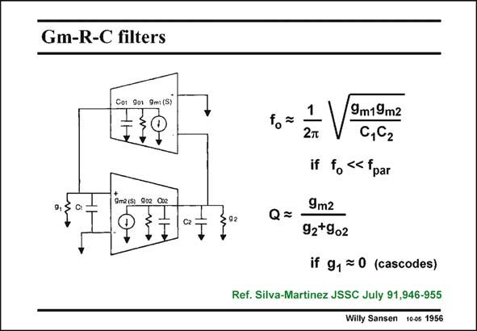

# SANSEN-1956 · Gm-R-C filters

章节：19 连续时间滤波器  
PDF 页：583；书本页：594；幻灯片编号：1956  
状态：unreviewed



## 对应教材讲解

### PDF 583 · 书本 594

For sake of illustration, a filter is shown consisting of only two Gm blocks in a feedback loop. It is clear that the resonant frequency f depends o on the g ’s and the capacim tances, at least if the parasitic capacitances do not come in yet. Also, the Q factor depends on the ratio of conductances, as shown. For a given set of small capacitances C and C , the 1 2 frequency f can be tuned o by adjusting g and g . Quality factor Q can then be tuned by adjusting the output conducm1 m2 tances g and g . Especially the former one g can be tuned as it is realized by a separate 2 o2 2 tunable resistor R, as shown next.

## 公式／性能结论候选摘录

以下为规则截取的原文，尚未逐项判读。

- PDF 583: It is clear that the resonant frequency f depends o on the g ’s and the capacim tances, at least if the parasitic capacitances do not come in yet.
- PDF 583: Also, the Q factor depends on the ratio of conductances, as shown.

## 曲线结论候选摘录

以下为规则截取的原文，尚未逐项判读。

（未由规则找到；不代表原页没有此类内容。）

## 原文条件与近似候选摘录

以下为规则截取的原文，尚未逐项判读。

（未由规则找到；不代表原页没有此类内容。）

## 幻灯片 OCR（未校正）

```text
Gm-R-C filters
Cor 901 9m: (S)
9,5
C:
9m2is 902 Cse
+ 1
C2
92
1
fo=
Q=
9m19m2
0,C2
if f « fpar
9m2
92+902
if g, ≥ 0 (cascodes)
Ref. Silva-Martinez JSSC July 91,946-955
Willy Sansen 10-0s 1956
```

数学上下标、分数及正负号以原图为准。电路图已保留；未核对的连接不输出成可仿真 netlist。
